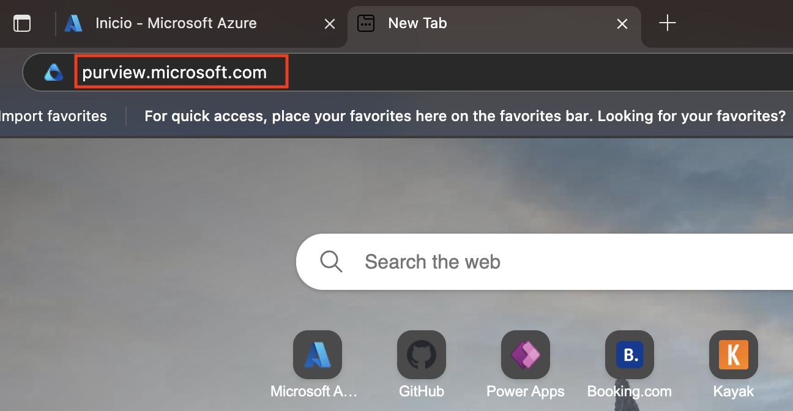
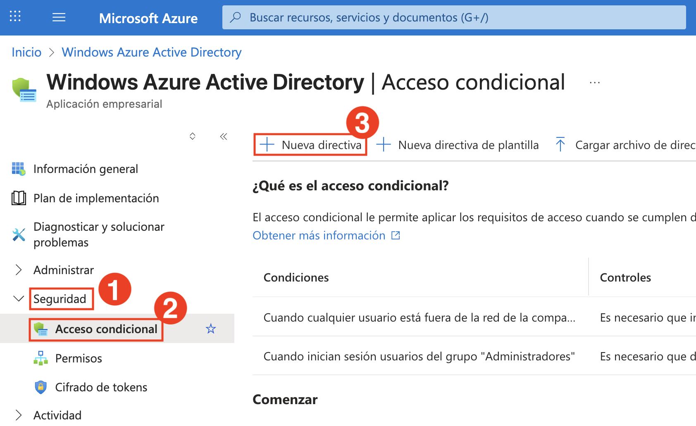
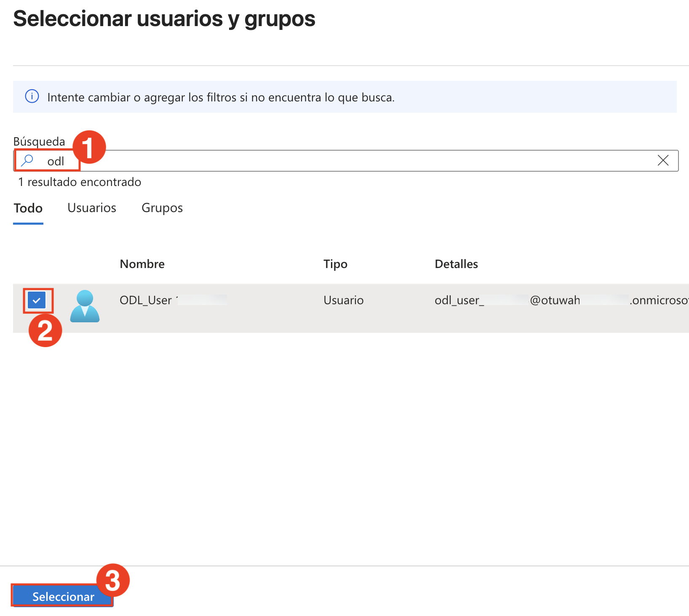
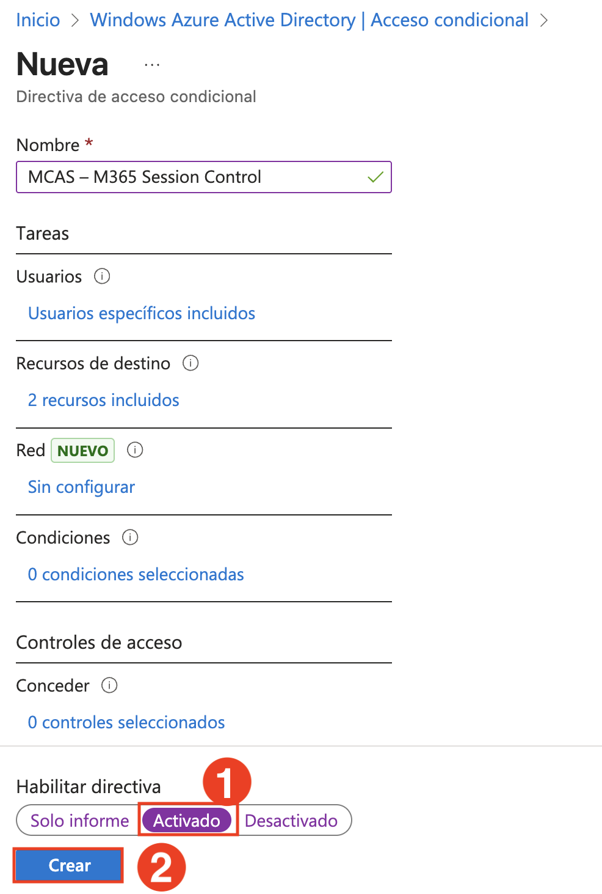
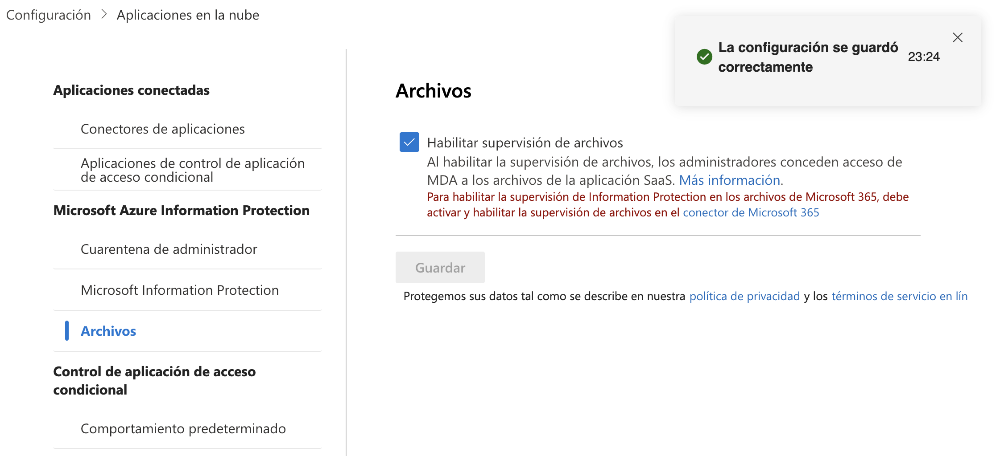
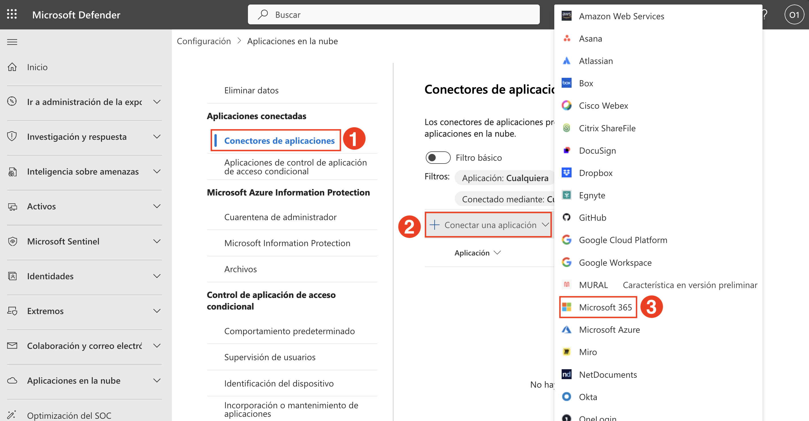
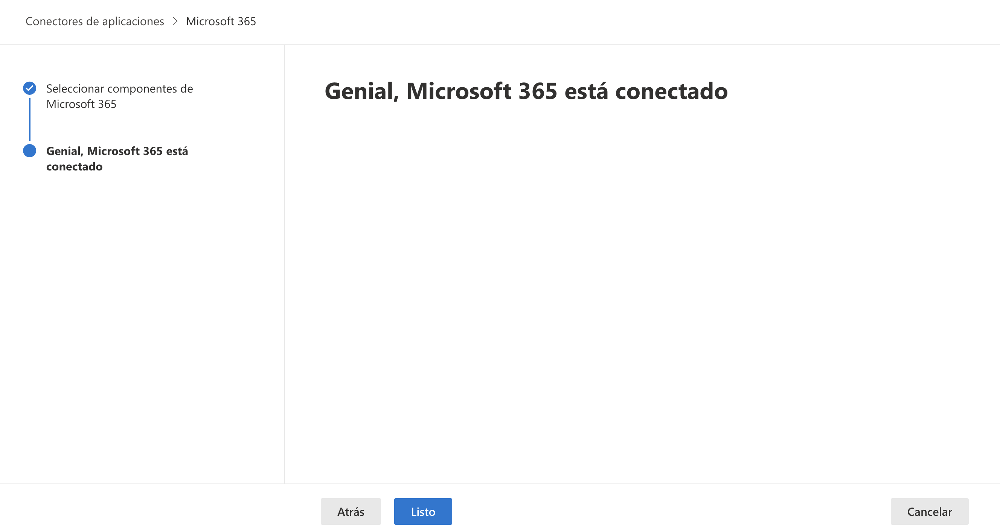

# **Día 2**

## Laboratorio 9: Conectar e Integrar una Aplicación SaaS a Microsoft Defender for Cloud Apps

En esta pestaña, verificará la asignación de licencias, habilitará la auditoría, configurará directivas de Acceso Condicional e integrará Microsoft 365 a Microsoft Defender for Cloud Apps.

1. En el navegador Edge, inicie sesión en el portal de Microsoft Defender mediante el siguiente enlace: https://portal.azure.com/ con el nombre de usuario y la contraseña que aparecen a continuación en caso de que se le solicite iniciar sesión.

    - **Correo electrónico/Nombre de usuario:** <inject key="AzureAdUserEmail"></inject>
 
       
 
   - **Contraseña:** <inject key="AzureAdUserPassword"></inject>

       

1. En la página de inicio del **portal de Azure**, busque **Microsoft Entra ID (1)** y seleccione **Microsoft Entra ID (2)** de los resultados.

   

1. En la página **Información general de Microsoft Entra ID**, expanda **Administrar (1)** y seleccione **Usuarios (2)**.

   

1. De la lista de usuarios, seleccione el **usuario** <inject key="Deployment-id" enableCopy="false"></inject>.

   

1. En la página de perfil de usuario, seleccione **Licencias (1)** y asegúrese de que el usuario tenga una licencia activa de **Microsoft 365 E5 (2)**.

   

1. En una nueva pestaña del navegador, vaya a `https://purview.microsoft.com`.

   

1. Si se le solicita, haga clic en **Introducción (1)** en el cuadro de diálogo de bienvenida de Microsoft Purview.

   

1. En la página de inicio de Microsoft Purview, haga clic en **Ver todas las soluciones (1)**.

   

1. En la sección **Core**, haga clic en el cuadro **Auditar**.

   

1. En la hoja **Auditar**, haga clic en **Grabar la actividad de usuarios y administradores**.

   

1. Cuando se le solicite, haga clic en **Yes** para completar la configuración organizacional.

    

    > **Nota:** La grabación de auditoría puede tardar unas horas en activarse. Puede continuar con el resto del ejercicio mientras se completa.

1. Vaya a la pestaña del portal de Azure y busque **Windows Azure Active Directory (1)**. Seleccione **Windows Azure Active Directory (2)** de los resultados.

    

1. En el menú de la izquierda, expanda **Seguridad (1)** y seleccione **Acceso condicional (2)**. Luego, haga clic en **+ Nueva directiva (3)**.

    

1. En la página **Nueva directiva de acceso condicional**, ingrese el nombre `MCAS – M365 Session Control`.

1. En **Tareas > Usuarios**, haga clic en **Usuarios específicos incluidos (1)**.  
    En la pestaña **Incluir (2)**, seleccione **Seleccione usuarios y grupos (3)** → marque **Usuarios y grupos (4)** → haga clic en **0 usuarios y grupos seleccionados (5)**.

    

1. En el panel **Seleccionar usuarios y grupos**, busque `<inject key="Deployment-id" enableCopy="false"></inject>
 `, marque la casilla junto a **ODL_User (2)**, y haga clic en **Seleccionar (3)**.

    

1. Confirme que el usuario aparezca en la sección **Usuarios**.

    

1. En **Recursos de destino**, haga clic en **1 recurso incluido (1)**.  
    En el panel derecho, en **Incluir (2)**, seleccione **Seleccionar recursos (3)** → haga clic en **Windows Azure Active Directory (4)** → marque **Office 365 (5)** → haga clic en **Seleccionar (6)**.

    

1. En **Controles de acceso > Sesión**, haga clic en **0 controles seleccionados (1)**.  
    En el panel Session, marque **Utilizar el Control de aplicaciones de acceso condicional (2)**, seleccione **Usar directiva personalizada (3)**, y haga clic en **Seleccionar (4)**.

    

1. En la parte inferior de la página, coloque **Habilitar directiva** en **Activado (1)** y haga clic en **Crear (2)**.

    

1. En el **portal de Microsoft Defender**, expanda **Sistema**, luego **Configuración**, seleccione **Aplicaciones en la nube**, vaya a **Microsoft Azure Information Protection (1)** → **Archivos (2)**.  
    A la derecha, marque **Habilitar supervisión de archivos (3)** y haga clic en **Guardar (4)**.

    

1. Espere el mensaje de confirmación: **La configuración se guardó correctamente**.

    

1. En **Connected apps**, seleccione **Conectores de aplicaciones (1)**. 
    - Haga clic en **Conectar una aplicación (2)** y seleccione **Microsoft 365 (3)** de la lista.
    - Seleccione todos los componentes de Microsoft 365 y haga clic en **Conectar Microsoft 365**.

    

    

1. En la siguiente pantalla, haga clic en **Listo** para confirmar que Microsoft 365 está conectado.

    

    Cuando aparezca **Microsoft 365 (1)** y haga clic en **+ Conectar (2)**. Siga el flujo para **Conectar con Azure**.

    

> **¡Felicitaciones** por completar el laboratorio! Ahora es el momento de validarlo. Estos son los pasos:
> - Presione el botón Validar de la tarea correspondiente. Si recibe un mensaje de éxito, puede continuar con la siguiente tarea. 
- De lo contrario, lea atentamente el mensaje de error y vuelva a intentar el paso, siguiendo las instrucciones de la guía del laboratorio.
- Si necesita ayuda, contáctenos en cloudlabs-support@spektrasystems.com. Estamos disponibles las 24 horas, los 7 días de la semana.
<validation step="d841263c-65e4-4a6c-ab16-b57b20463af8" />

## Revisión

En este laboratorio, ha completado lo siguiente:

- Conectó e incorporó una aplicación SaaS de terceros a Microsoft Defender for Cloud Apps.
- Verificó la conexión exitosa a través del panel de aplicaciones conectadas.

### Ha completado el Laboratorio con éxito. Haga clic en **Siguiente >>** para continuar con el siguiente Laboratorio.

