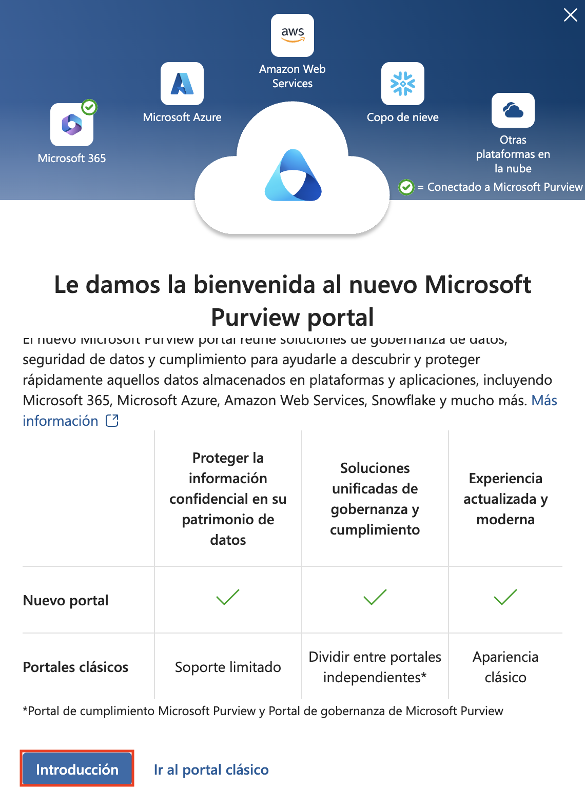
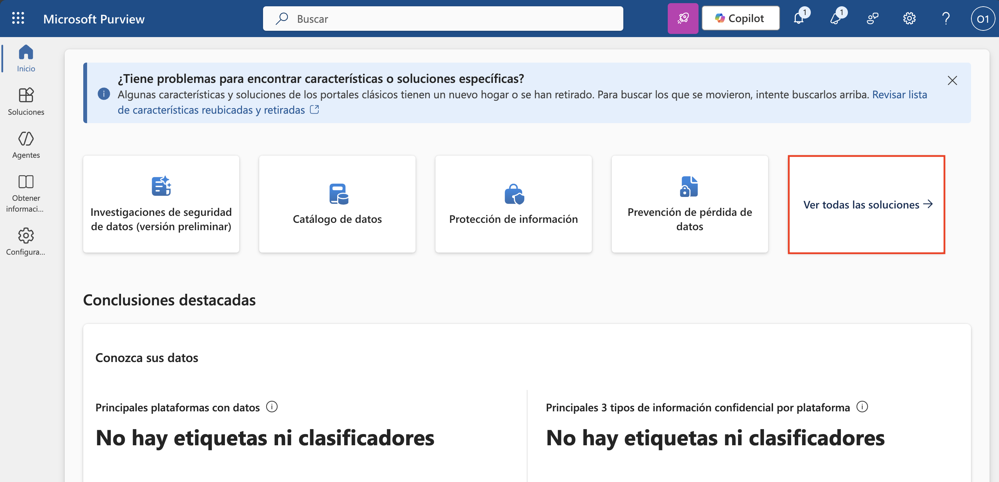
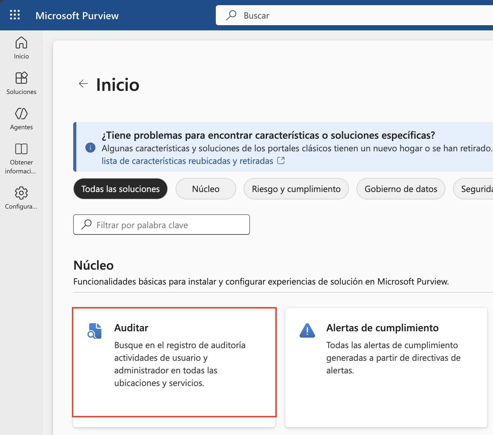
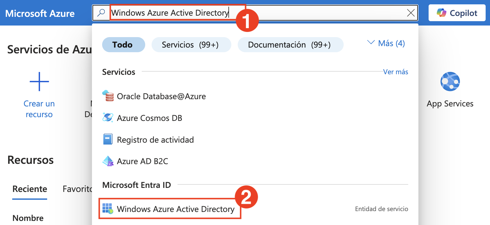
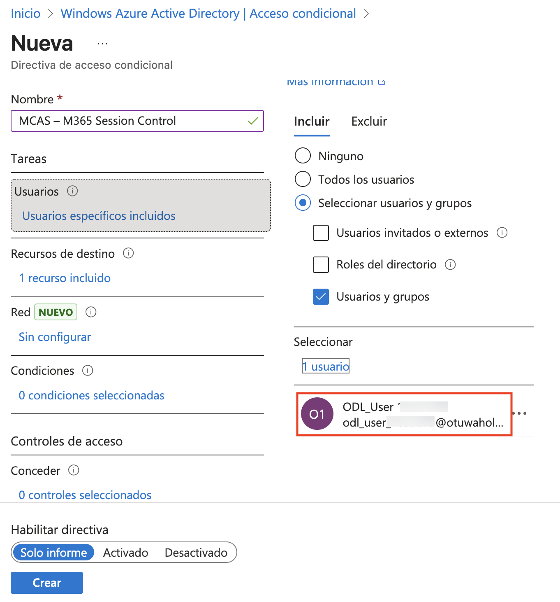
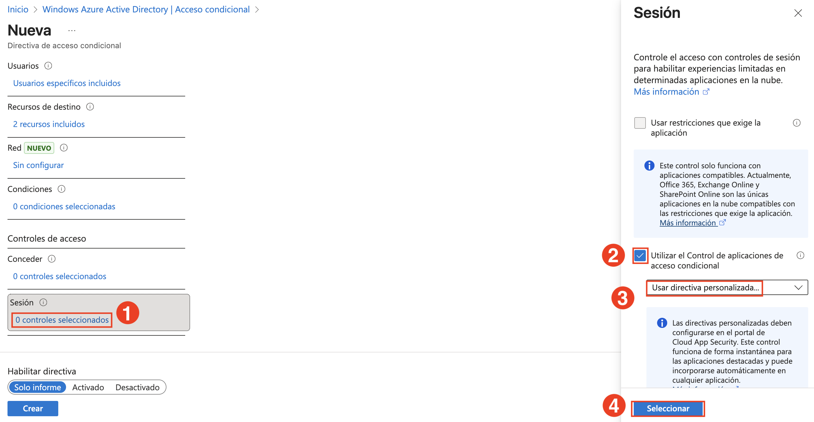
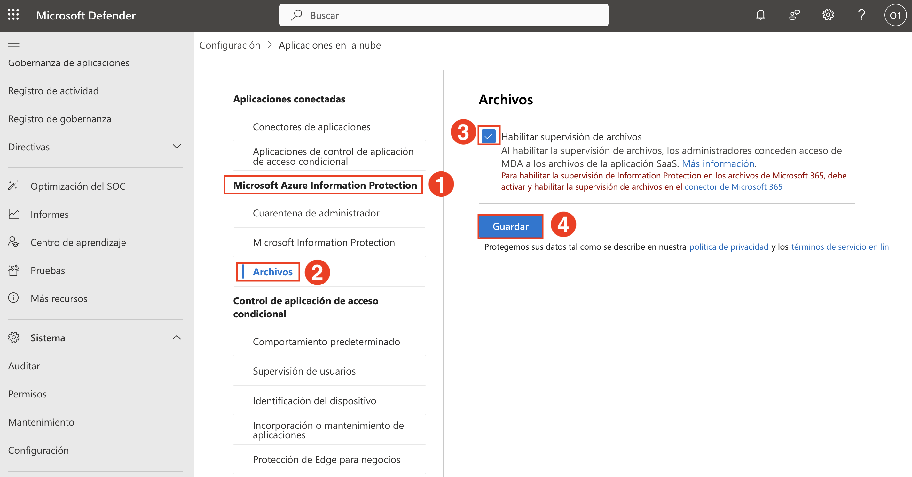

# Day 2

## Task 9: Connect and Onboard a SaaS App to Microsoft Defender for Cloud Apps

In this task, you'll verify license assignment, enable auditing, configure Conditional Access policies, and onboard Microsoft 365 to Defender for Cloud Apps.

1. In the Edge browser, log-in to Microsoft Defender portal using the following link: https://portal.azure.com/ with the below username and password if prompted to sign in.

    - **Email/Username:** <inject key="AzureAdUserEmail"></inject>
 
       
 
   - **Password:** <inject key="AzureAdUserPassword"></inject>

       

1. On the **Azure portal** homepage, search for **Microsoft Entra ID (1)** and select **Microsoft Entra ID (2)** from the results.

   

1. On the **Microsoft Entra ID Overview** page, expand **Manage (1)** and select **Users (2)**.

   

1. From the list of users, select the **user** <inject key="Deployment-id" enableCopy="false"></inject>.

   

1. On the user profile page, select **Licenses (1)** and ensure the user has an active **Microsoft 365 E5 (2)** license.

   

1. In a new browser tab, go to `https://purview.microsoft.com`.

   

1. If prompted, click **Get started (1)** on the Microsoft Purview welcome dialog.

   

1. On the Microsoft Purview homepage, click on **View all solutions (1)**.

   

1. Under the **Core** section, click on the **Audit** tile.

   

1. On the **Audit** blade, click **Start recording user and admin activity**.

   

1. When prompted, click **Yes** to complete the organizational setup.

    

    > **Note:** It may take a few hours for audit recording to become active. You may continue with the rest of the exercise while it completes.

1. Switch to the Azure portal tab and search for **Windows Azure Active Directory (1)**. Select **Windows Azure Active Directory (2)** from the results.

    

1. On the left menu, expand **Security (1)** and select **Conditional Access (2)**. Then click **+ New policy (3)**.

    

1. On the **New policy** page, enter the name `MCAS – M365 Session Control`.

1. Under **Assignments > Users**, click **Specific users included (1)**.  
    In the **Include (2)** tab, select **Select users and groups (3)** → check **Users and groups (4)** → click **0 users and groups selected (5)**.

    

1. In the **Select users and groups** pane, search for `<inject key="Deployment-id" enableCopy="false"></inject>
 `, check the box next to **ODL_User (2)**, and click **Select (3)**.

    

1. Confirm that the user is now listed under the **Users** section.

    

1. Under **Target resources**, click **1 resource included (1)**.  
    In the right pane, under **Include (2)**, select **Select resources (3)** → click **Windows Azure Active Directory (4)** → check **Office 365 (5)** → click **Select (6)**.

    

1. Under **Access controls > Session**, click **0 controls selected (1)**.  
    In the Session panel, check **Use Conditional Access App Control (2)**, select **Use custom policy (3)**, and click **Select (4)**.

    

1. At the bottom of the page, toggle **Enable policy** to **On (1)** and click **Create (2)**.

    

1. In the **Microsoft Defender portal**, expand **Cloud apps**, go to **Information Protection (1)** → **Files (2)**.  
    On the right, check **Enable file monitoring (3)** and click **Save (4)**.

    

1. Wait for the confirmation message: **Configuration saved successfully**.

    

1. Under **Connected apps**, select **App Connectors (1)**.  
    Check **Microsoft 365 (2)** and click **+ Connect (3)**.

    

1. On the next screen, click **Done** to confirm that Microsoft 365 is connected.

    

> **Congratulations** on completing the task! Now, it's time to validate it. Here are the steps:
> - Hit the Validate button for the corresponding task. If you receive a success message, you can proceed to the next task. 
> - If not, carefully read the error message and retry the step, following the instructions in the lab guide.
> - If you need any assistance, please contact us at cloudlabs-support@spektrasystems.com. We are available 24/7 to help you out.
<validation step="d841263c-65e4-4a6c-ab16-b57b20463af8" />

## Review

In this lab, you have completed the following tasks:

- Connected and onboarded a third-party SaaS application to Microsoft Defender for Cloud Apps.
- Verified successful connection through the connected apps dashboard.

### You have successfully completed the lab. Click on **Next >>** to proceed with the next Lab.

