## Exercise 2: Analyze Threats and Configure Protection Policies in Microsoft Defender for Office 365

### Estimated Duration: 60 Minutes

## Overview

In this exercise, you will analyze threats using Microsoft Defender for Office 365’s built-in investigation tools and configure protection policies to strengthen your organization’s email security. You'll start by creating a custom role, simulating a phishing scenario, and investigating user behavior using Threat Explorer and real-time detections. Then, you’ll create custom Anti-Phishing and Safe Links policies, set up alert rules, and simulate a threat to validate policy effectiveness and detection capabilities.

## Objectives

- Task 1: Analyze Threats with Threat Explorer and Real Time Detections
- Task 2: Configure Anti-Phishing and Safe Links Polices

## Task 1: Analyze Threats with Threat Explorer and Real-Time Detections

In this task, you'll create a custom role in Microsoft Defender to manage access and permissions, simulate a phishing interaction, and investigate user activity using Threat Explorer.

1. On a new tab in the **Microsoft Edge browser** and go to the following URL in the address bar: https://security.microsoft.com.

1. Open a new tab, navigate to https://outlook.office.com, sign in with the lab user’s credentials, and access the mailbox.

   > **Note:** If the **Your privacy matters** pop-up appears, click **Continue** to proceed.

      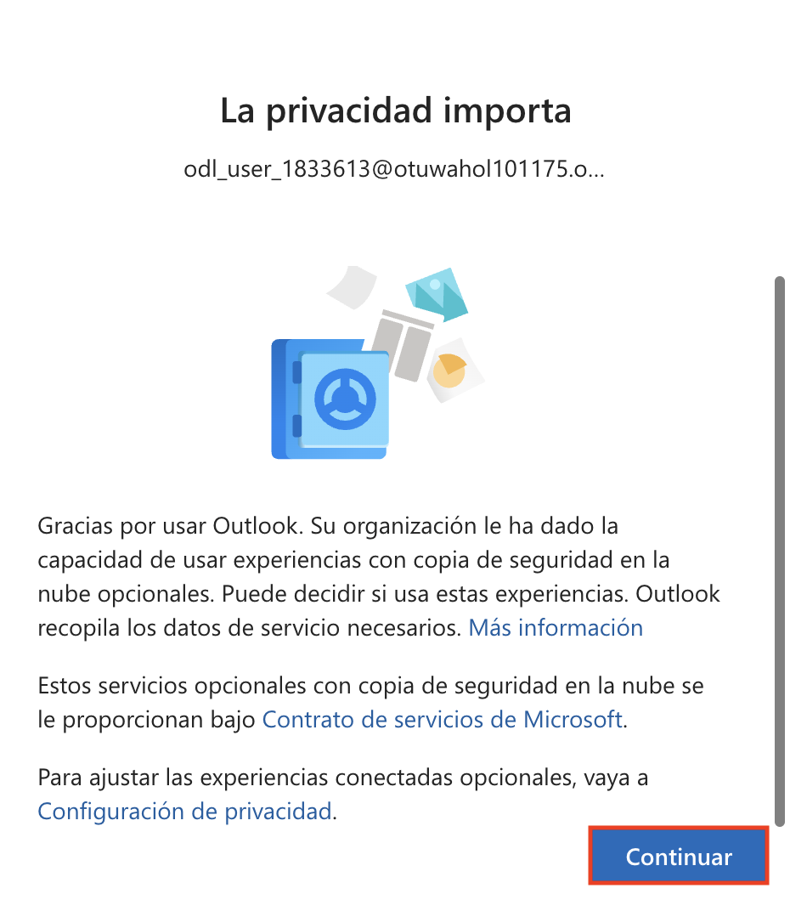

1. In the mailbox, select the **phishing simulation email (1)** and click the **link (2)** provided in the message body to proceed.

   

1. On the **Sign in** page, type any random email address (1) and click **Next (2)**.

   

1. On the **Enter password** page, type any random password (1) and click **Sign in (2)**.

   

1. After submitting the fake credentials, the phishing simulation results page will appear indicating that you were phished. Review the message and proceed as instructed in the lab.

   

      > Note: This activity simulates a phishing attack and trigger credential submission logs.

1. A training assignment email is also generated for users who fall for the phishing simulation. In the mailbox, open the **Training assignment notification** email and review the details.

   

1. In the mailbox, select the malware attachment simulation email to view its contents.

   

1. With the malware attachment simulation email open, click the **More actions (1)** menu, select **Report (2)**, and then click **Report phishing (3)**.

   

1. In the **Report phishing** confirmation dialog, click **Report** to submit the phishing report.

   

1. After reporting the phishing email, a confirmation message will be sent to your mailbox. Open the **Thank you for reporting a phish!** email to review the acknowledgment.

   

1. In the **Microsoft Defender portal**, do the following:

   - Select **Email & collaboration (1)** from the left navigation pane.
   - Click **Explorer (2)** under the Email section.
   - In the **URL clicks** tab, select the entry for the clicked timestamp.
   - Review the **URL (4)** that was clicked to investigate further.

      

   > **Note:** Sometimes the Microsoft Defender portal can take 1–2 hours for initial backend data to load. If refreshing the page doesn’t display results, check back later.

      
   
   > **Note:** If no data appears after waiting and refreshing, skip ahead to step 14 to continue with the lab.

1. Click on the **Open url page** to open the full event details.

   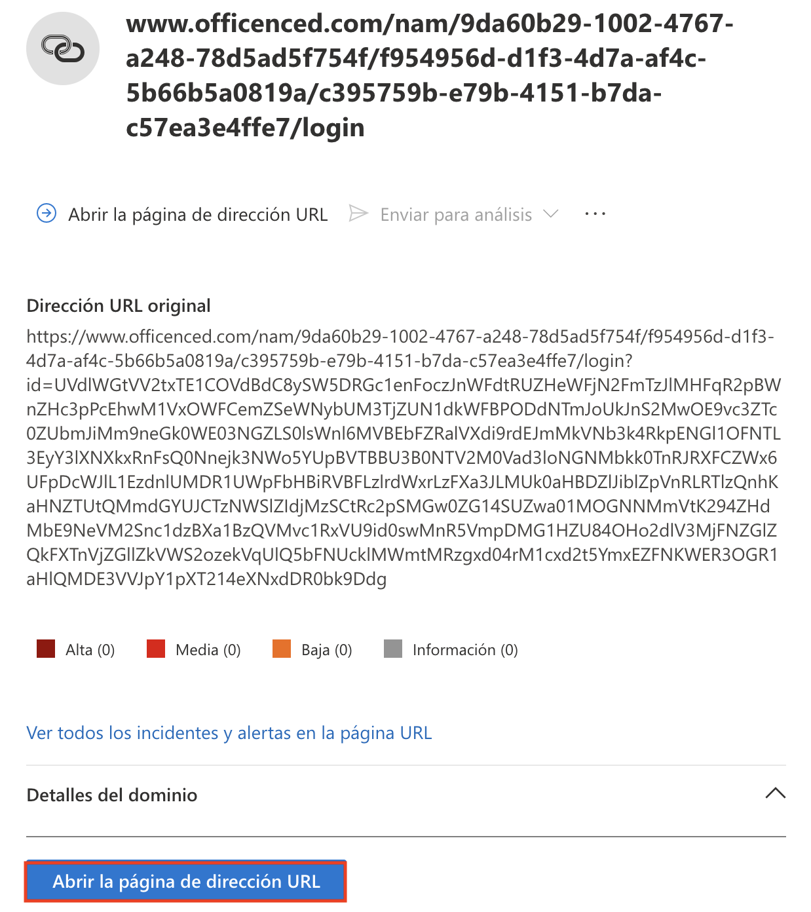

   > Note: This shows the clicked URL, click metadata, and incident correlation.

1. In the **Microsoft Defender portal**, do the following:

   - Select **Email & collaboration (1)** from the left navigation pane.  
   - Click **Attack simulation training (2)**.  
   - Navigate to the **Simulations (3)** tab.  
   - Locate and select the simulation named **Test1 (4)** from the list.

      

1. View the simulation report to observe the results.  
   In this example, 100% of users were compromised and 0% reported the phishing attempt.

   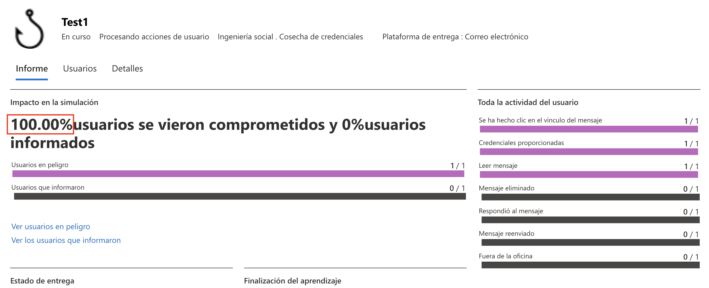

1. Click the **Affected user** to view detailed actions taken during the simulation such as reading the email, clicking the link, and submitting credentials.

   

   > Note: This data helps evaluate user behavior and identify high-risk individuals.

1. Navigate back to the **Simulations** tab, select the simulation named **Test2**, and view the report details for the malware attachment simulation.

## Task 2: Configure Anti-Phishing and Safe Links Policies

In this task, you will create a custom Anti-Phishing policy and Safe Links policy to enhance protection against malicious emails and phishing links. You will also simulate a phishing email and verify alerts and detections.

1. On the **Microsoft Defender portal**, go to **Email & collaboration (1)** > **Policies & rules (2)** and selct **Threat Policies**. Under **Policies**, select **Anti-phishing (3)**.

   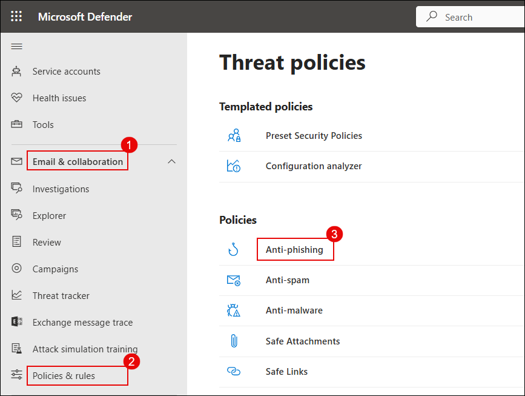

1. On the **Anti-phishing** page, click **Create (1)** to begin a new policy.

   

1. Enter the name **Anti-Phish (1)** and click **Next (2)**.

   

1. Under **Users, groups, and domains**, add the user **ODL User (1)** and click **Next (2)**.

   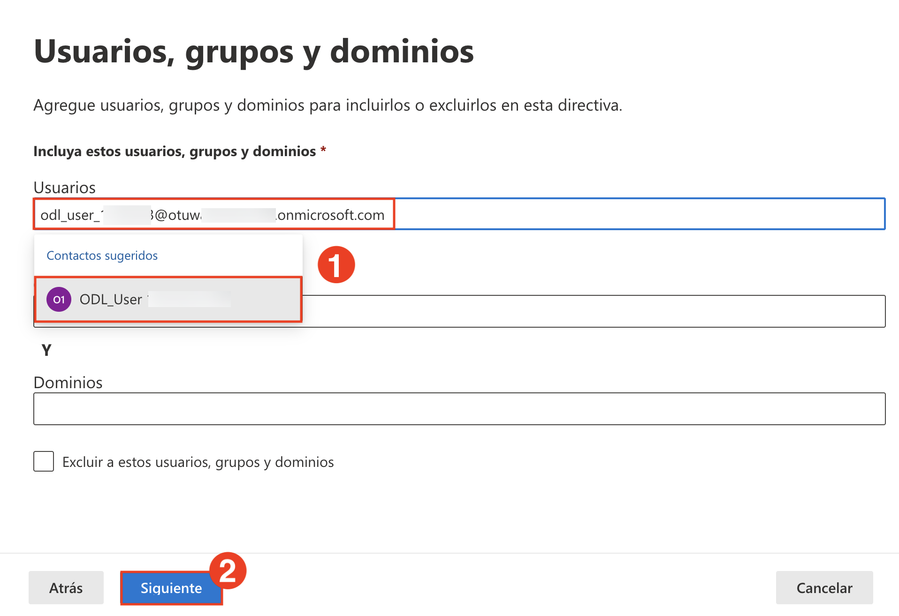

1. Set the **Phishing email threshold** to **4 - Most Aggressive** to enable maximum protection.

   

1. Under **Trusted senders and domains**, check the following options:

    - **Enable mailbox intelligence (1)**
    - **Enable Intelligence for impersonation protection (2)**
    - **Enable spoof intelligence (3)**  
    - Then click **Next (4)**. 
     
      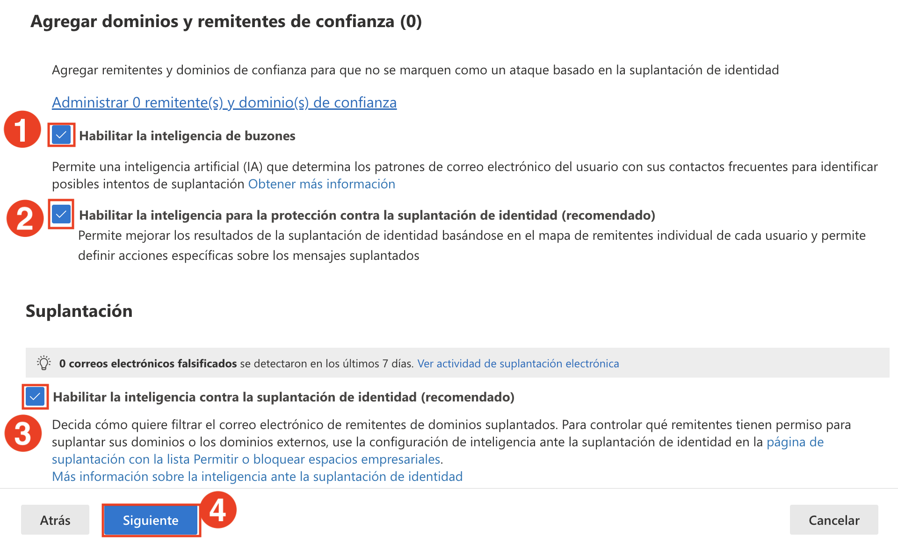

1. Under **Message actions**, configure the following and click **Next (5)**.

   - If Mailbox Intelligence detects an impersonated user:  
     **Move the message to the recipients’ Junk Email folders (1)**
   - For spoof messages with DMARC policy = quarantine:  
     **Move to Junk Email (2)**
   - For spoof messages with DMARC policy = reject:  
     **Quarantine the message (3)**
   - For spoof detection by spoof intelligence:  
     **Move to Junk Email (4)**  

      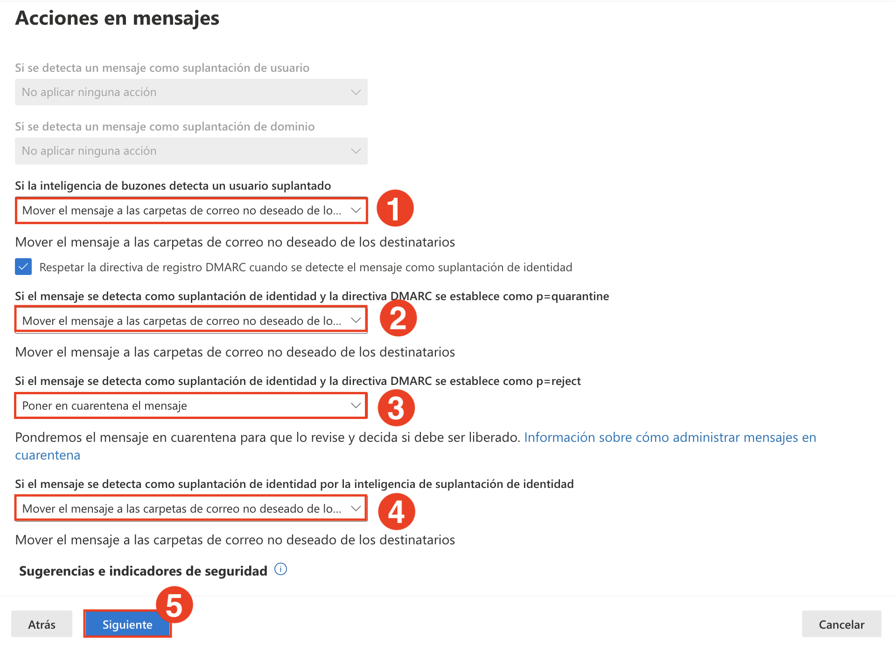

1. Back on the **Threat policies** page, go to **Email & collaboration (1)** > **Policies & rules (2)**, then select **Safe Links (3)**.

   

1. Enter the policy name **Anti-Safe (1)** and click **Next (2)**.

   

1. Under **Users and domains**, add the user **ODL_User (1)** and click **Next (2)**.

    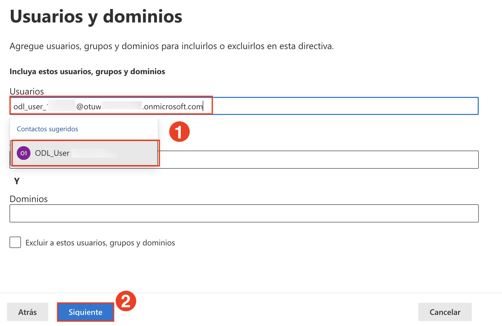

1. In **URL & click protection settings**, ensure all checkboxes are enabled, including:

    - Email Safe Links
    - URL scanning
    - Teams and Office 365 apps protection
    - Click tracking  

    Then click **Next**.

    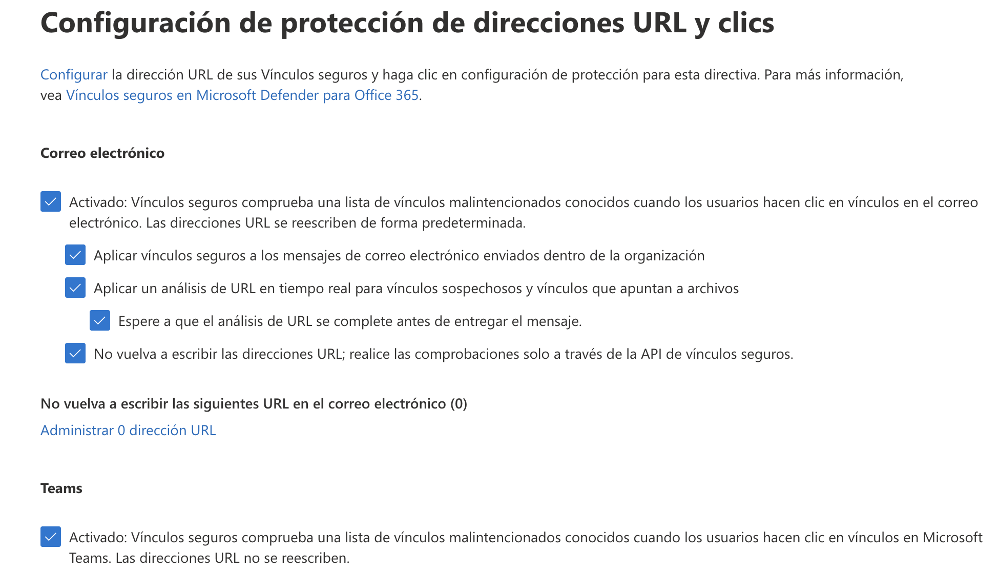

1. Navigate to **Email & collaboration (1)** > **Policies & rules (2)** > **Alert policy (3)**.

    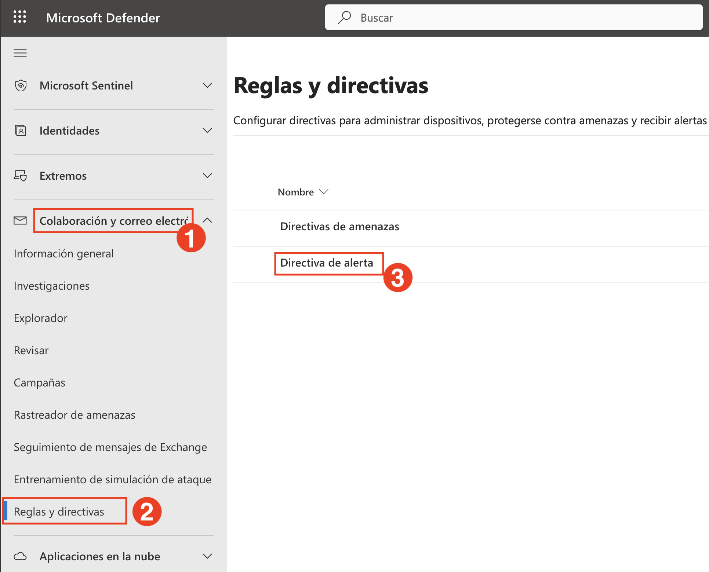

1. On the **Alert policy** page, click **+ New Alert Policy**.

    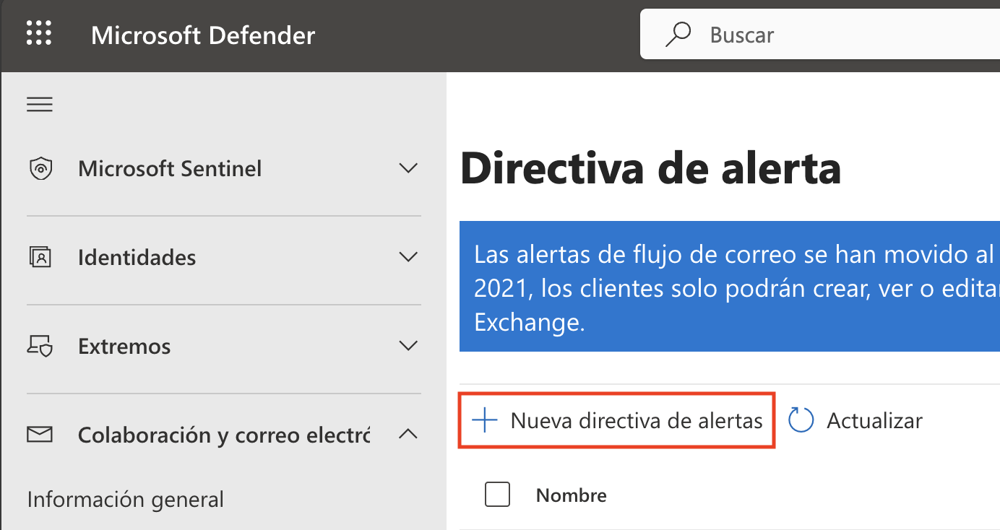

1. Enter the following details:
    
    - **Name (1):** Alert-Safe  
    - **Severity (2):** High  
    - **Category (3):** Threat management  
      
      Click **Next (4)**.

      

1. For the activity condition, configure the following and click **Next (4)**.

    - **Activity (1):** Detected malware in an email message  
    - **Mail direction (2):** Inbound  
    - **Trigger (3):** Every time an activity matches the rule  

      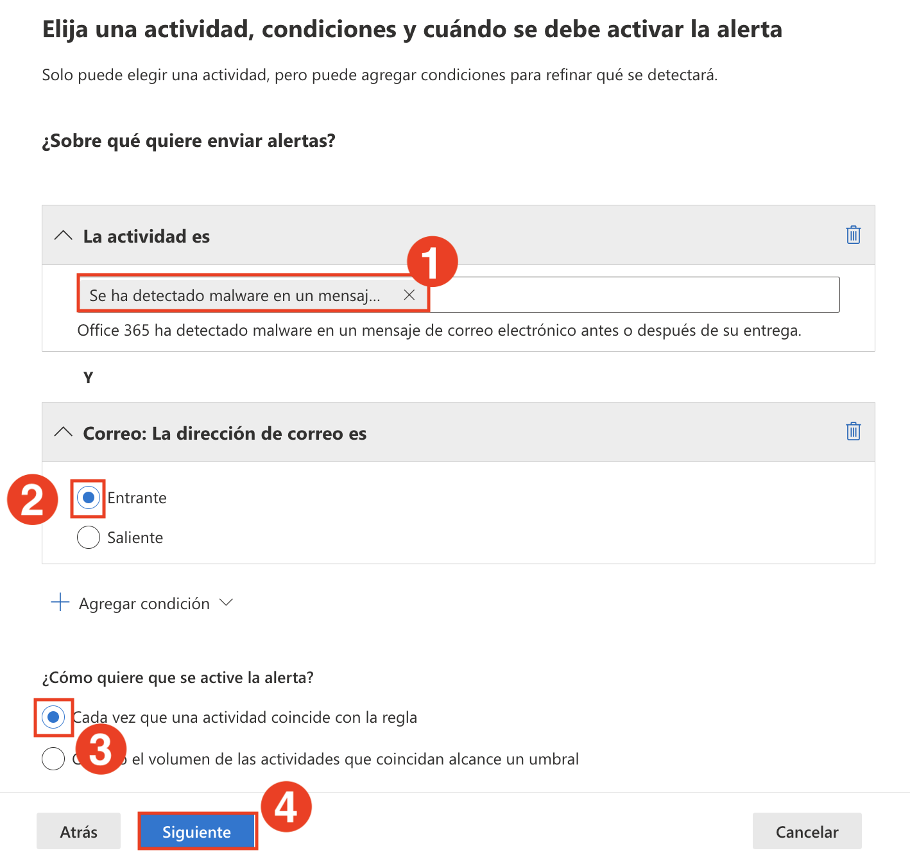

1. Add the recipient's email address **(1)** and click **Next (2)**.

    

1. Review the alert settings, choose **Yes, turn it on right away (1)**, and click **Submit (2)**.

    

   > **Note:** Your alert policy is now active and will trigger if matching activity is detected.

1. Send a test email with sample malicious links to simulate a threat:
    
    - **(1)** https://www.amtso.org/check-desktop-phishing-page/  
    - **(2)** https://malware.wicar.org/data/eicar.com.txt  
    - Click **Send (3)** to deliver the email.

    

1. Navigate to **Email & collaboration (1)** > **Explorer (2)** and locate the test email **Test-safe (3)**.

    

1. Click **Open email entity (1)** and verify that:
    
    - **Original location:** Quarantine  
    - **Delivery action:** Blocked  
    - **Detection technologies:** URL malicious reputation, Mixed analysis detection  

      

1. Finally, go to **Investigation & response (1)** > **Incidents (2)**. Select the alert incident **Alert-Link (3)** and click on the incident name **(4)** to investigate further.

    

   >  Dive deep into the incident: review alerts, evidence, entities involved, and the automated investigation trail.

   >  You’ve now created an alert policy, triggered it with test emails, and followed the investigation trail using Defender XDR.

## Review

In this lab, you have completed the following tasks:

- Created a custom role in Microsoft Defender to manage access and permissions.
- Simulated a phishing interaction and investigated user activity using Threat Explorer.
- Analyzed real-time detections and simulation reports to assess user risk.
- Configured custom Anti-Phishing and Safe Links policies to enhance threat protection.
- Created an alert policy and validated it by simulating a phishing and malware email.

### You have successfully completed the lab. Click on **Next >>** to proceed with the next Lab.

