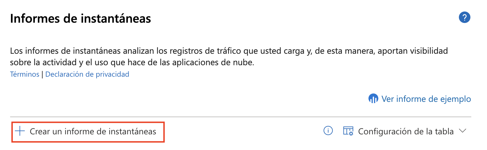
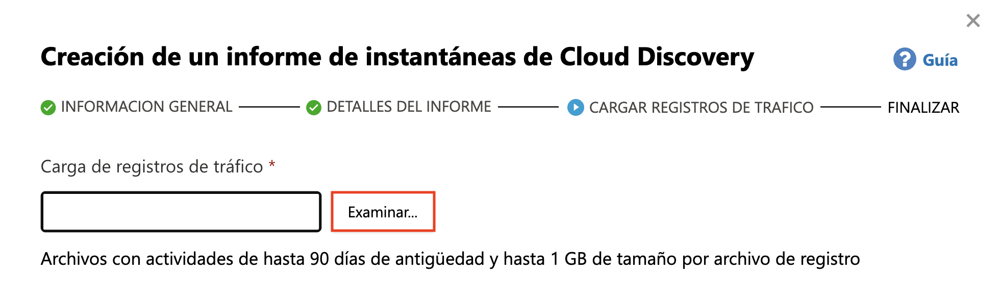
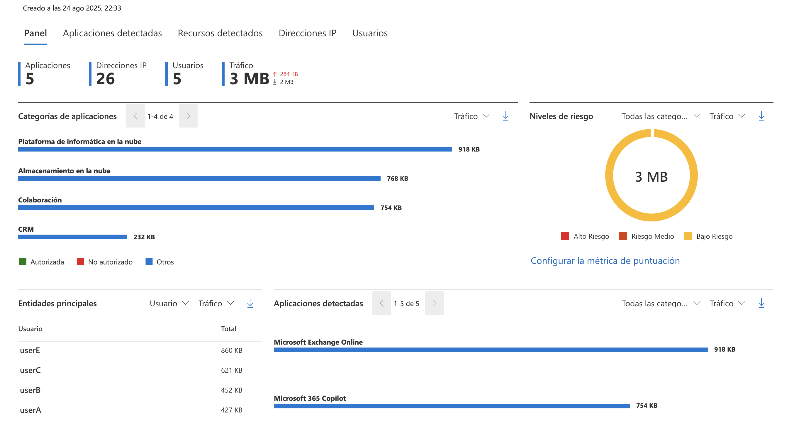
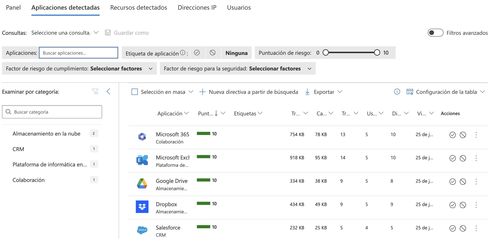

## Exercise 4: Discover and Analyze Shadow IT with Microsoft Defender for Cloud Apps

### Estimated Duration: 60 Minutes

## Overview

In this exercise, you will use Microsoft Defender for Cloud Apps to uncover and analyze shadow IT activity in your organization. You’ll start by integrating Defender for Endpoint with Defender for Cloud Apps and enabling app discovery. Then, you’ll generate a snapshot report using uploaded traffic logs, explore discovered applications, assess risk levels, and identify unsanctioned apps to improve cloud visibility and control.

> **Important Usage Guidance**

> Some changes or configurations made during this lab may take a few minutes to reflect in the Microsoft Defender for Office 365 portal. This includes security recommendations, alerts, and resource status updates. If updates are not visible immediately, please allow some time and refresh the portal before proceeding.

> Microsoft Defender for Office 365 may take some time to load certain results or complete specific tasks from the backend. This is expected behavior. If the data does not appear after a couple of refresh attempts, proceed with the next task in the lab and return later to check the results.

## Objectives

- Task 1: Microsoft Defender for Cloud Apps-Configuring Cloud Discovery
- Task 2: Discover and Analyze Shadow IT Using Cloud Discovery 

## Task 1: Microsoft Defender for Cloud Apps- Configuring Cloud App Discovery

In this task, you will integrate Defender for Cloud Apps with Microsoft Defender for Endpoint, enable discovery of shadow IT, and analyze data using snapshot reports.

1. On the **Microsoft Defender portal**, select **System (1)** and click **Settings (2)**.

   

1. On the **Settings** page, click **Endpoints (2)** under the **Settings (1)** category.

   

1. If prompted with a loading screen, wait for the workspace setup to complete.

   

1. Under the **Endpoints** settings, select **Advanced features (1)**. Toggle **Microsoft Defender for Cloud Apps (2)** to **On**, then click **Save preferences (3)**.

   

1. Go back to **Settings (1)** and select **Cloud Apps (2)** from the list.

   

1. Under **Cloud Discovery**, click **Microsoft Defender for Endpoint (1)** and check the box to **Enforce app access (2)**.

   
   > **Note:**  Enabling app access enforcement helps automatically block apps marked as unsanctioned based on Defender for Endpoint insights.

1. Scroll down the left pane under **Cloud Discovery (1)** and select **Snapshot reports (2)**.

   

1. Click on **Create snapshot report**.

   

1. On the **Overview** step, click **Next** to continue.

   

1. Enter a name for your report (e.g., **Test Report**) (1), choose your log source (e.g., **Blue Coat ProxySG – Access log**) (2), then click **Next (3)**.

   

1. On the **Upload traffic logs** screen, click **Browse…** to upload a log file.

   

1. In the file picker, select **bluecoat_sample.log (1)** and click **Open (2)**.

   

1. After uploading the file, click **Upload logs**.

   

1. Once the report is ready, verify the status shows **Ready**.

   

1. Click the report to open and analyze discovered apps, IPs, users, and traffic risk levels.

   

## Task 2: Discover and Analyze Shadow IT Using Cloud Discovery

1. Analyze the report for the following options:

    - **Check the Summary Metrics:** Look at the total number of apps, users, IP addresses, and traffic volume to understand the overall cloud usage.
    
    - **Review App Categories**: Identify which categories (e.g., Cloud Computing, Storage, Collaboration) are using the most bandwidth and check if any unsanctioned apps are involved.
    
    - **Analyze Risk Levels**: Use the risk level chart to see how much traffic is coming from low, medium, or high-risk apps—focus on medium/high risk.
    
    - **Identify Top Users**: Check the “Top entities” section to see which users are generating the most traffic, especially to risky or unsanctioned apps.
    
    - **Inspect Discovered Apps**: Review the list of apps in use, their traffic volume, and verify if they are approved or need to be blocked or reviewed further.

1. In the dashboard, navigate to **Discovered Apps** section.

   

1. This section lists all discovered apps, showing their risk score, traffic volume, number of users, and last activity.

   

1. Click on the elipsis next to any of the applications to mark the app as **Unsactioned**. This action labels the app as not approved for use, helping you monitor and report on its usage in the dashboard.

   

## Review

In this lab, you have completed the following tasks:

- Enabled integration between Defender for Endpoint and Defender for Cloud Apps.
- Generated a snapshot report using traffic logs to discover cloud app usage.
- Analyzed shadow IT activity, assessed app risk levels, and marked unsanctioned apps.

### You have successfully completed the lab.
