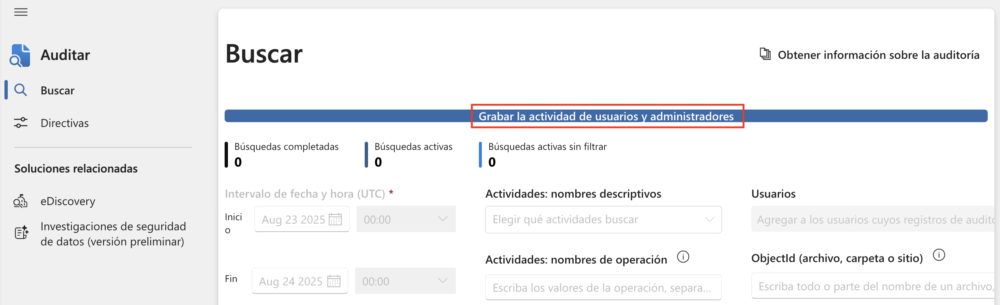
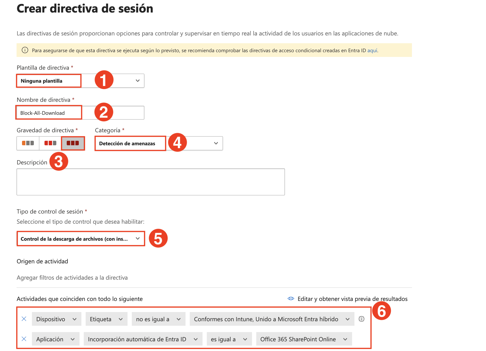
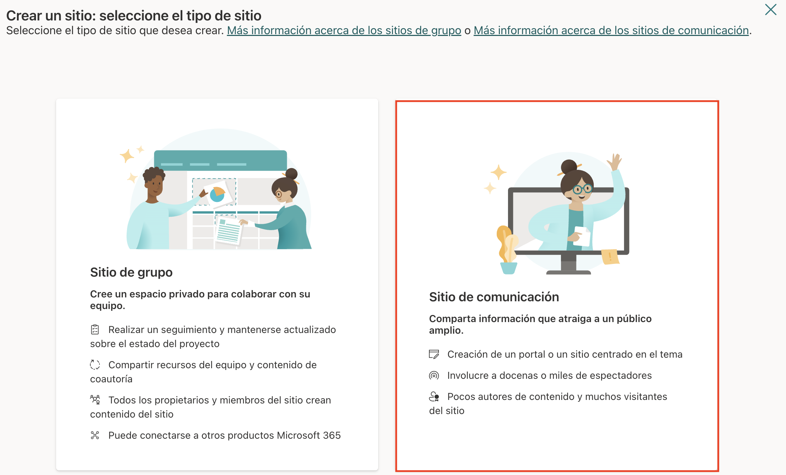
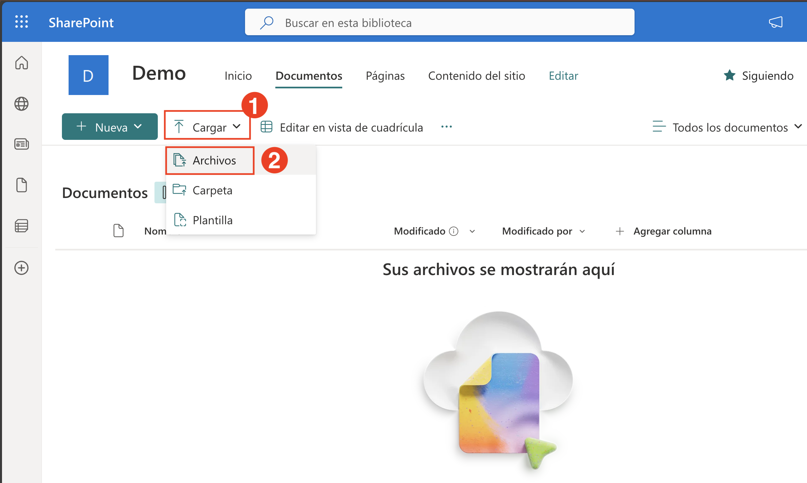

## Exercise 1: Connect SaaS Apps and Configure Session Policies in Microsoft Defender for Cloud Apps

### Estimated Duration: 60 Minutes

## Overview

In this exercise, you will connect and onboard a third-party SaaS application to Microsoft Defender for Cloud Apps to enable real-time monitoring and control. After onboarding, you'll configure session control policies to detect and block risky behaviors such as file downloads and suspicious user activity. These policies help enforce granular access and session control based on user context, device state, and activity risk—empowering your organization to prevent data leakage and insider threats in real time.

## Objectives

- Task 1: Connect and Onboard a SaaS App to Microsoft Defender for Cloud Apps  
- Task 2: Configure Session Policies to Monitor and Block Risky Behavior

## Task 1: Connect and Onboard a SaaS App to Microsoft Defender for Cloud Apps

In this task, you'll verify license assignment, enable auditing, configure Conditional Access policies, and onboard Microsoft 365 to Defender for Cloud Apps.

1. On the **Azure portal** homepage, search for **Microsoft Entra ID (1)** and select **Microsoft Entra ID (2)** from the results.

   

1. On the **Microsoft Entra ID Overview** page, expand **Manage (1)** and select **Users (2)**.

   

1. From the list of users, select the **user** <inject key="Deployment-id" enableCopy="false"></inject>.

   

1. On the user profile page, select **Licenses (1)** and ensure the user has an active **Microsoft 365 E5 (2)** license.

   

1. In a new browser tab, go to `https://purview.microsoft.com`.

   

1. If prompted, click **Get started (1)** on the Microsoft Purview welcome dialog.

   

1. On the Microsoft Purview homepage, click on **View all solutions (1)**.

   

1. Under the **Core** section, click on the **Audit** tile.

   

1. On the **Audit** blade, click **Start recording user and admin activity**.

   

1. When prompted, click **Yes** to complete the organizational setup.

    

    > **Note:** It may take a few hours for audit recording to become active. You may continue with the rest of the exercise while it completes.

1. Switch to the Azure portal tab and search for **Windows Azure Active Directory (1)**. Select **Windows Azure Active Directory (2)** from the results.

    

1. On the left menu, expand **Security (1)** and select **Conditional Access (2)**. Then click **+ New policy (3)**.

    

1. On the **New policy** page, enter the name `MCAS – M365 Session Control`.

1. Under **Assignments > Users**, click **Specific users included (1)**.  
    In the **Include (2)** tab, select **Select users and groups (3)** → check **Users and groups (4)** → click **0 users and groups selected (5)**.

    

1. In the **Select users and groups** pane, search for `<inject key="Deployment-id" enableCopy="false"></inject>
 `, check the box next to **ODL_User (2)**, and click **Select (3)**.

    

1. Confirm that the user is now listed under the **Users** section.

    

1. Under **Target resources**, click **1 resource included (1)**.  
    In the right pane, under **Include (2)**, select **Select resources (3)** → click **Windows Azure Active Directory (4)** → check **Office 365 (5)** → click **Select (6)**.

    

1. Under **Access controls > Session**, click **0 controls selected (1)**.  
    In the Session panel, check **Use Conditional Access App Control (2)**, select **Use custom policy (3)**, and click **Select (4)**.

    

1. At the bottom of the page, toggle **Enable policy** to **On (1)** and click **Create (2)**.

    

1. In the **Microsoft Defender portal**, expand **Cloud apps**, go to **Information Protection (1)** → **Files (2)**.  
    On the right, check **Enable file monitoring (3)** and click **Save (4)**.

    

1. Wait for the confirmation message: **Configuration saved successfully**.

    

1. Under **Connected apps**, select **App Connectors (1)**.  
    Check **Microsoft 365 (2)** and click **+ Connect (3)**.

    

1. On the next screen, click **Done** to confirm that Microsoft 365 is connected.

    

> **Congratulations** on completing the task! Now, it's time to validate it. Here are the steps:
> - Hit the Validate button for the corresponding task. If you receive a success message, you can proceed to the next task. 
> - If not, carefully read the error message and retry the step, following the instructions in the lab guide.
> - If you need any assistance, please contact us at cloudlabs-support@spektrasystems.com. We are available 24/7 to help you out.
<validation step="d841263c-65e4-4a6c-ab16-b57b20463af8" />

## Task 2: Configure Session Policies to Monitor and Block Risky Behavior

In this task, you will create a Microsoft Defender for Cloud Apps session policy to block downloads of risky files (e.g., `.exe`, `.apk`) from SharePoint Online for non-compliant devices.

1. On the **Microsoft Defender portal**, navigate to **Policies (1)** under **Cloud apps**, then click **Policy management (2)**. On the **Policies** page, click **All policies (3)** at the top. Then select **Create policy (4)** and choose **Session policy (5)** from the dropdown.

   

1. On the **Create session policy** page, set the following values:
   - **Policy template (1)**: No template
   - **Policy name (2)**: Block-All-Download
   - **Policy severity (3)**: High (Red)
   - **Category (4)**: Threat detection
   - **Session control type (5)**: Control file download (with inspection)

   In the **Activity source** section, define the following filters:
   - **Device | Tag | does not equal | Intune compliant, Microsoft Entra Hybrid joined**
   - **App | Manual onboarding | equals | Microsoft SharePoint Online**

      

1. In the **Files matching all of the following** section, add file extension filters:
   - **Extension equals exe**
   - **OR apk (1)**

   Under **Actions**, select **Block (2)**.

   

1. Scroll down and click **Update** to save the policy.

   

    Now simulate the download attempt to validate the policy.

1. On your desktop, right-click the **Microsoft Edge (1)** shortcut, go to **Send to (2)** and select **Documents (3)**.

   

1. Navigate to **https://portal.office.com**, open **SharePoint**, and click **Create site**.

   

1. Choose **Communication site**.

   

1. Provide a **Site name (1)** as "Demo" and click **Next (2)**.

   

1. On the **language selection** page, select **English (1)** and click **Create site (2)**.

    

1. Once the site loads, click the **menu icon** on the top left to expand the navigation.

    

1. In the left navigation panel, click **Documents**.

    

1. On the **Documents** page, click **Upload (1)** and select **Files (2)**.

    

1. In the file picker window, browse to **Documents (1)**, select the **Microsoft Edge shortcut (2)**, and click **Open (3)**.

    

1. After the upload, verify that the file **msedge.exe** appears in the list.

    

1. Attempt to download the file by clicking **Download** on the preview screen.

    

1. A message appears saying the **Download is blocked**, confirming the session policy is working.

    

   > **Note:** Session policies apply only to browser-based sessions. To block access from mobile or desktop apps, configure **Access policies** separately.

## Review

In this lab, you have completed the following tasks:

- Connected and onboarded a third-party SaaS application to Microsoft Defender for Cloud Apps.
- Verified successful connection through the connected apps dashboard.
- Created session policies to detect risky behaviors such as file downloads and suspicious user activity.
- Tested policy enforcement to ensure risky actions were blocked or monitored in real time.

You’ve implemented real-time monitoring and control over SaaS applications using Defender for Cloud Apps.

### You have successfully completed the lab. Click on **Next >>** to proceed with the next Lab.

