## Exercise 6: Implement App Governance and Create Custom Detection Policies in Microsoft Defender for Cloud Apps

### Estimated Duration: 60 Minutes

## Overview

In this exercise, you will implement App Governance and deploy Microsoft Defender for Identity to strengthen your organization’s threat detection and response capabilities. First, you’ll enable App Governance to detect high-risk OAuth applications and create custom policies to flag apps with excessive permissions. Then, you'll investigate alerts, analyze user activities, and create a detection policy to monitor suspicious file downloads. Finally, you’ll install and configure the Microsoft Defender for Identity sensor on a domain controller to enable real-time monitoring of identity-based threats such as lateral movement and domain enumeration.

> **⚠ Important Usage Guidance**

> Microsoft Defender for Office 365 may take some time to load certain results or complete specific tasks from the backend. This is expected behavior. If the data does not appear after a couple of refresh attempts, proceed with the next task in the lab and return later to check the results.

## Objectives

- Task 1: Implement App Governance and Risk Detection for OAuth Apps (`Read-Only`)
- Task 2: Investigate Alerts and Create Custom Detection Policies
- Task 3: Onboard a Device
- Task 4: Deploy Microsoft Defender for Identity Sensor on Domain Controllers

## Task 1: Implement App Governance and Risk Detection for OAuth Apps (`Read-Only`)

In this task, you will explore how to enable App Governance in Microsoft Defender XDR and configure a custom detection policy to flag high-risk OAuth apps based on their permissions and publisher status. This is a **read-only task** because, after turning on App Governance, it can take **4–5 hours** for connected OAuth apps to appear and be fully evaluated by the system.

1. On the **Microsoft Defender portal**, go to **System (1)** > **Settings (2)** and click **Cloud Apps (3)**.

   

1. Under **App governance**, select **Service status (1)** and click **Turn on app governance (2)**.

   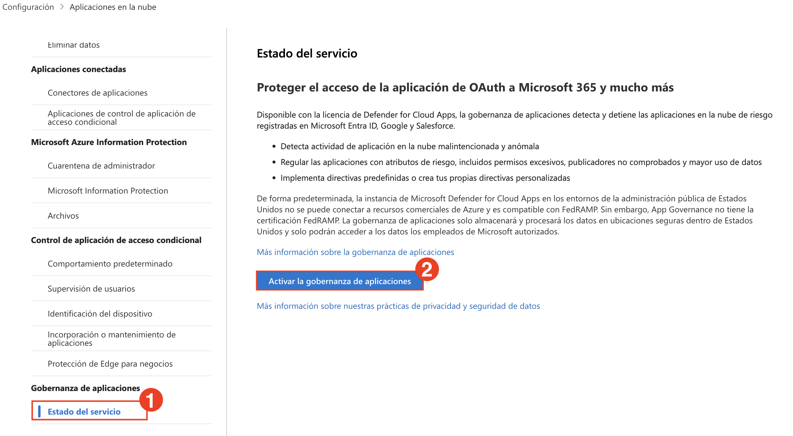

   > App Governance is now activated. It will begin evaluating connected OAuth apps and generating insights into their behavior and risk posture.

1. On the OAuth apps page, click **Go to app governance**.

   

   > You may be redirected to the new App Governance interface.

1. In the left menu, go to **Cloud apps (1)** > **Governance log (2)** and select the **AuditLogApp (3)** from the listed apps.

   

1. In the AuditLogApp details pane, select the **Permissions (1)** tab and review the permissions classified as **High privilege (2)**.

   

   > You've now reviewed an OAuth app's access level and identified potentially risky permissions that may require action.

1. Go to the **Policies (1)** tab > select **Microsoft 365 (2)**, then click **Create policy (3)**.

   

1. In the **Choose a policy template** pane, select **Custom (1)** > **Custom policy (2)** and click **Next (3)**.

   

1. Name the policy as **Detect High-Permission OAuth Apps (1)**, set **Severity to High (2)**, and click **Next (3)**.

   

1. Select **No, I’ll customize the policy (1)**, then click **Next (2)**.

   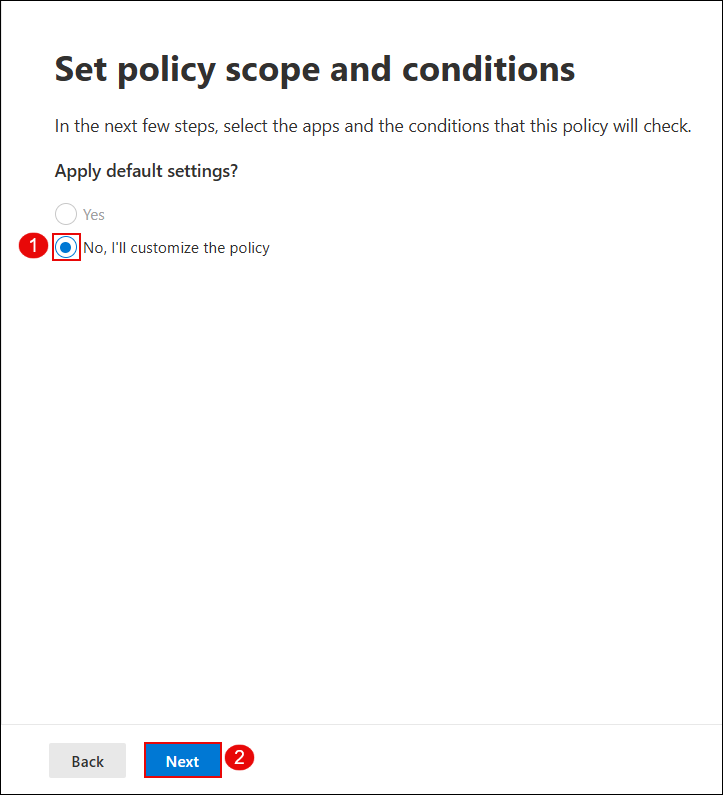

1. Under policy scope, select **All apps (1)** and click **Next (2)**.

   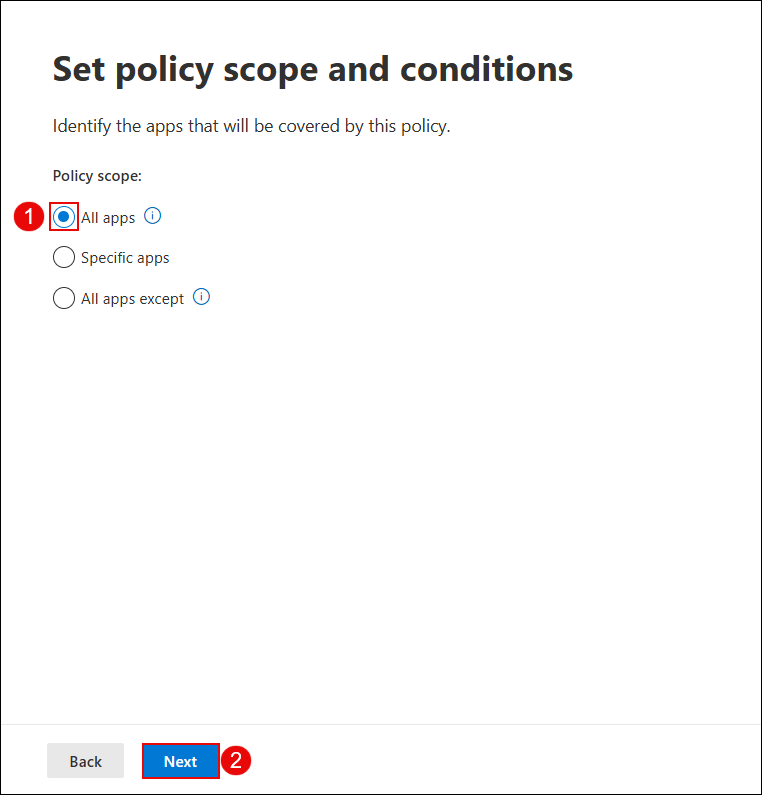

1. Configure the policy conditions:  
    - Set **Highly privileged (1)** to **Yes (2)**  
    - Set **Publisher verified (3)** to **No (4)**  
    - Click **Save (5)**

      

1. In the **Set policy action** step, choose **Disable app (1)** and click **Next (2)**.

   

1. Set the policy status to **Active (1)** and click **Next (2)**.

   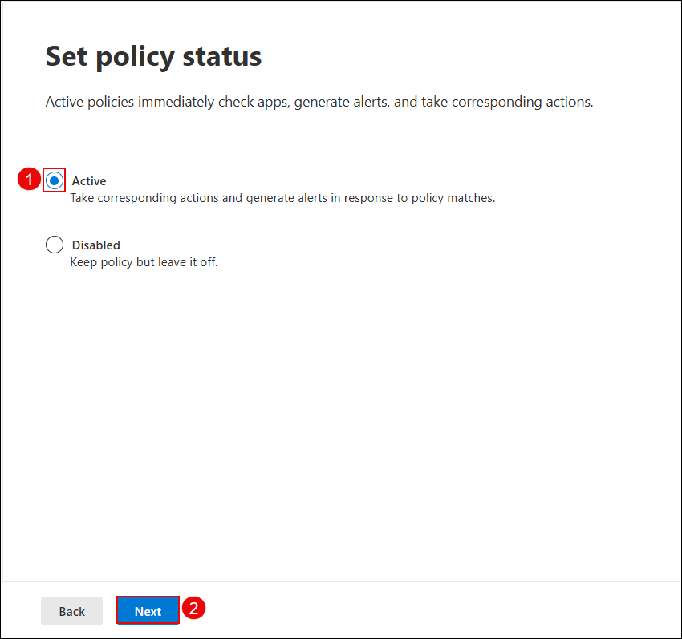

1. Review the policy settings and click **Submit** to create the policy.

   

1. On the confirmation screen, click **Done** to finish.

   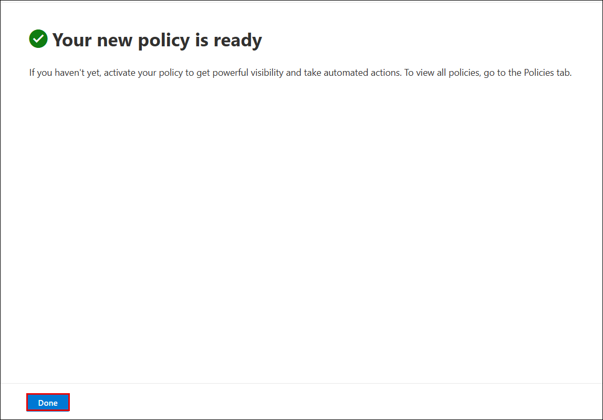
   
   > The detection policy is now active and will monitor all onboarded OAuth apps for risky permissions and unverified publishers.

1. Back on the **App governance** overview, click **View all apps** to analyze detected apps.

   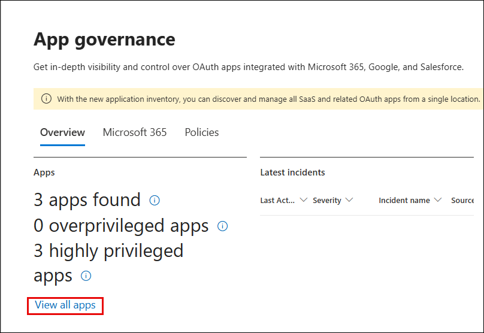

1. In the **Microsoft 365 (1)** tab, notice apps flagged with a **High (2)** privilege level.

   

1. Go to **Incidents & alerts (1)** > **Incidents (2)**, and click the incident **Detect High-Permission OAuth Apps (3)**.

   

1. In the incident details pane, review the violation summary, app, and policy triggered.

   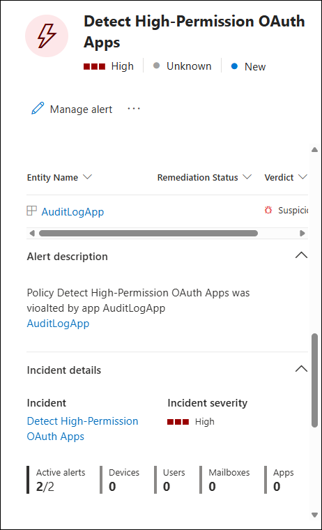

## Task 2: Investigate Alerts and Create Custom Detection Policies

1. In the Microsoft Defender Portal, go to **Cloud Apps** → **Activity log**.

1. Under the **App** filter, click on **Select apps** (3), select **Microsoft SharePoint Online**

    

   > **Note:** Once selected, all user activities performed in SharePoint—such as file uploads, downloads, edits, and access attempts—will be visible in the activity log.

1. Go to **Incidents & alerts** → **Alerts**, and look for `Block-All-Download`.

   

1. Click the alert, then select **Open alert page**.
   
   

1. Click **Investigate in activity log**.
 
   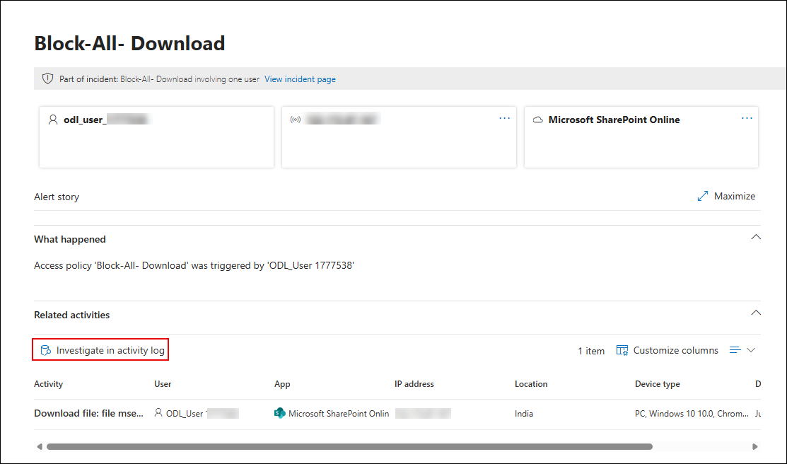

   

1. Go to **Cloud Apps** → **Policy management**, and click **Create policy** → **Activity policy**.

   

1. Configure the following:

   - **Policy template:** `No template`
   - **Policy name:** `Detect Suspicious File Download – msedge.exe`  
   - **Severity:** `High`  
   - **Category:** `Threat detection`  
   - **Act on:** `Single activity`  
   - **Activity type:** `Download file`  
   - **Files and folders:** `msedge.exe`  
   - **App:** `Microsoft SharePoint Online`
   
      

1. Click **Edit and preview results**, review matches, then click **Save filters**.

   

1. Under **Alerts**, enable **Send alert as email**, add a valid address, set daily alert limit to `5`.

1. Click **Create** to save and activate the policy.

   

1. Simulate a download again in SharePoint, and downloading `msedge.exe`.
    
   

   

   

1. Open your Outlook email inbox and locate the alert email titled `Alert - Detect Suspicious File Download – msedge.exe`.
   
   

   > **Note:** If you do not see the alert email, wait for 5–10 minutes and refresh your inbox.

1. In the portal, go to **Incidents & alerts** → **Alerts**, and open the alert.
   
   

1. Click **Open alert page** → **view incident page**.

   

1. Carefully review the event details:

    - User name  
    - File name  
    - App used  
    - IP address  
    - Device info  
    - Triggered policy
   
      

### Task 3: Onboard a Device

1. Navigate to **Settings** in the left menu bar, and then, on the Settings page, choose **Endpoints**.

    

    > **Note:** The **Endpoints** option under **Settings** may take a few moments to appear after the initial setup.

    > If you don't see it right away, wait a minute and try refreshing the page.

1. Navigate to the **Onboarding** option in the Device Management section.

    >**Note:** Device onboarding can also be initiated from the **Assets** section on the left menu bar. Expand 'Assets' and choose 'Devices.' On the Device Inventory page, with 'Computers & Mobile' selected, scroll down to find the option for **Onboard devices.** Clicking on this option will direct you to the **Settings > Endpoints** page.

1. In the '1. Onboard a device' section, ensure that 'Local Script (for up to 10 devices)' is visible in the Deployment method drop-down, then click the **Download onboarding package** button.

     

1. In the *Downloads* pop-up, use your mouse to select the 'WindowsDefenderATPOnboardingPackage.zip' file, and then click on the folder icon for **Show in folder**. **Hint:** If you can't locate it, the file should be in the 'c:\users\admin\downloads' directory.

    

1. Right-click on the downloaded zip file, choose **Extract All...**, ensure that **Show extracted files when complete** is checked, and then click **Extract**.

     

1. Right-click on the extracted file 'WindowsDefenderATPLocalOnboardingScript.cmd' and choose **Properties**. Tick the **Unblock** checkbox located in the bottom right of the Properties window, and then click **OK**.

     

1. Once again, right-click on the extracted file **WindowsDefenderATPLocalOnboardingScript.cmd** and opt for **Run as Administrator**. **Hint:** If the Windows SmartScreen window appears, click on **More info**, and then select **Run anyway**.
    
1. When the "User Account Control" window appears, select **Yes** to allow the script to run, answer **Y** to the question presented by the script, and press **Enter**. Once complete, you should see a message in the command screen that says *Successfully onboarded machine to Microsoft Defender for Endpoint*.

1. Press any key to continue. This action will close the Command Prompt window.

    

1. Back on the Onboarding page within the Microsoft 365 Defender portal, navigate to the "2. Run a detection test" section, and copy the detection test script by clicking the **Copy** button.

    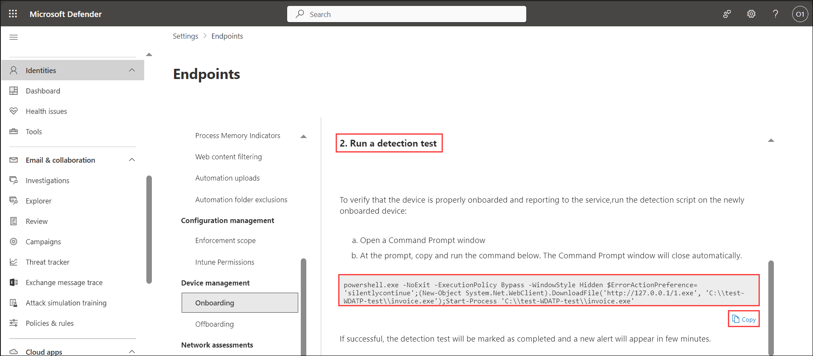 

1. In the Windows search bar of the virtual machine, type **CMD**, and choose **Run as Administrator** from the right pane for the Command Prompt app.

1. When the "User Account Control" window appears, select **Yes** to allow the app to run. 

1. Paste the script by right-clicking in the **Administrator: Command Prompt** window and press **Enter** to run it. **Note:** The window closes automatically after running the script.

1. In the Microsoft 365 Defender portal, navigate to the left-hand menu, and under the **Assets** area, select **Devices**. If the device is not shown, proceed with the next task and return to check it later. It can take up to 60 minutes for the first device to be displayed in the portal.

     

    >**Note:** If you have completed the onboarding process and don't see devices in the Devices list after an hour, it might indicate an onboarding or connectivity problem.

### Task 4: Deploy Microsoft Defender for Identity Sensor on Domain Controllers

In this task you will install and configure the Defender for Identity sensor on a domain controller to monitor identity-based threats.

Install the AD DS role to enable the server to function as a domain controller.

1. Open **Server Manager**:
   - Click the **Start** button and select **Server Manager**, or type "Server Manager" in the search bar and press **Enter**.

      

2. Launch the **Add Roles and Features Wizard**:
   - In Server Manager, click **Manage** in the top-right corner, then select **Add Roles and Features**.

      

3. Configure the Wizard:
   - Select **Role-based or feature-based installation**, then click **Next**.
   - Choose your server from the server pool, then click **Next**.
   - In the "Server Roles" list, check **Active Directory Domain Services**.

      

   - When prompted, click **Add Features** to include required tools, then click **Next**.
   - Skip the "Features" page by clicking **Next**.
   - Review the AD DS information page, then click **Next**.
   - Confirm your selections and click **Install**.
   - Wait for the installation to complete and click on **Close**.

      

   > **Note:** Do not close Server Manager after installation; the next step begins from there.

1. In Server Manager, click the yellow notification flag and select **Promote this server to a domain controller**.

      

1. In the wizard, select **Add a new forest** and enter the root domain name as `defenderxdr.internal`, then click **Next**.

      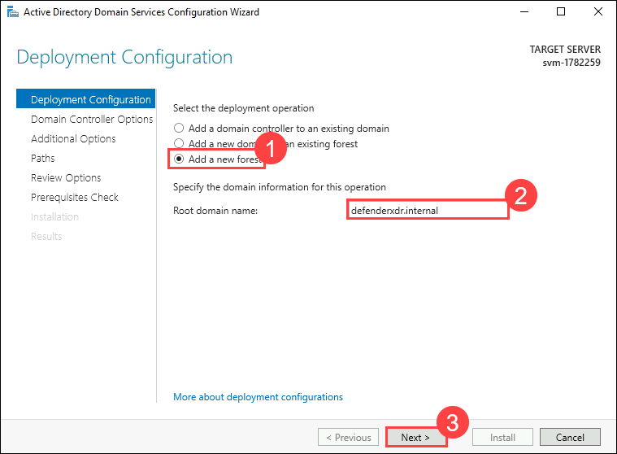

1. Set Domain Controller Options:
   - Set both **Forest Functional Level** and **Domain Functional Level** to **Windows Server 2016** (or your server’s version).
   - Ensure **Domain Name System (DNS) server** is checked.
   - Enter a **Directory Services Restore Mode (DSRM)** password (e.g., `P@ssw0rd123!`), then click **Next**.

      

   - Ignore DNS delegation warnings, click on **Next**.
   - Accept the default **NetBIOS domain name** `DEFENDERXDR`, then click **Next**.

      

   - Use default paths for the AD DS database, logs, and SYSVOL, then click **Next**.
   - Review your selections, then click **Next**.
   - Wait for the prerequisites check to complete, then click **Install**.
   - Wait for the process to complete; the server will restart automatically.

      > **Note:** The VM will restart now, wait for 5 minutes and **Reconnect** to the VM.

      

1. Sign in to the Microsoft Defender Portal, open a Edge browser and navigate to `security.microsoft.com`.

   - If you see the **Sign in to Microsoft Azure** tab, you will see the login screen. Enter the following email/username, and click on **Next**.

   * **Email/Username:** <inject key="AzureAdUserEmail"></inject>
     
      

   - Now enter the following password and click on **Sign in**.
   
   * **Password:** <inject key="AzureAdUserPassword"></inject>

      

      >**Note:** Take a moment to allow the option panel to fully load on the security portal.
      
1. On the Microsoft Defender page, select **Settings** and select **Identities** and you will be navigated to **Microsoft Defender for Identity** page.

      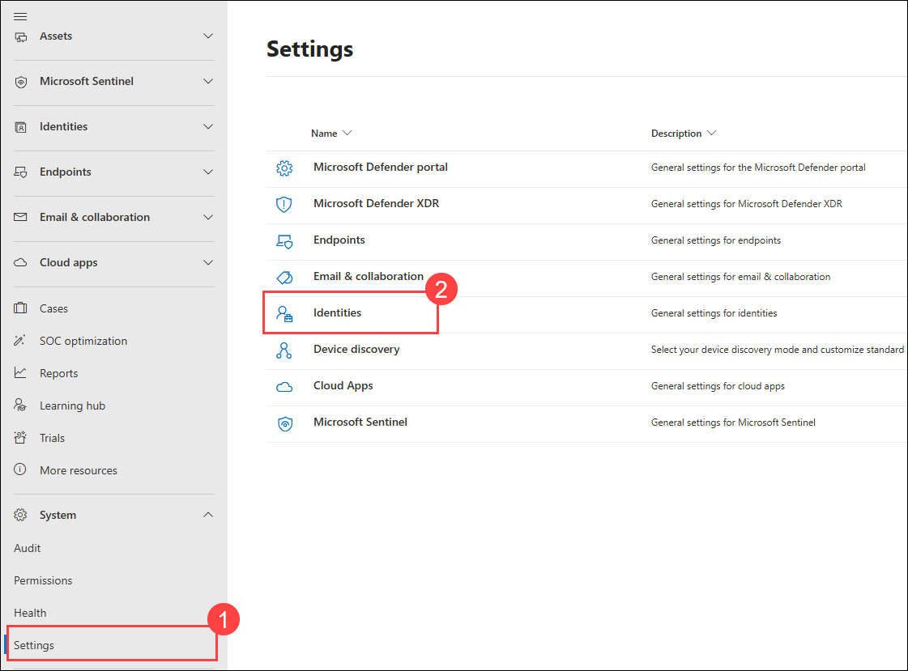

      >**Note:** Please wait while the **identities** page loads—this may take a few minutes.

1. Click on **Sensors** at the top, then select **Add sensor** in the top-right corner. On the **Simplify your installation process** pop-up, click **Continue with classic sensor**.

      

1. A pop-up will display a **Download installer** button and an **Access key**. Click **Download installer** to download `Azure ATP Sensor Setup.zip` and copy the **Access key** to your clipboard which will be used during the installation.

      
      > **Note:** If you do not see that the file is downloading, click on the pop-up window button and then select Always allow pop-ups and redirects from `https://security.microsoft.com`and click on **Done** and **download** the file again

      

1. From your VM, navigate to the downloaded `Azure ATP Sensor Setup.zip` file in the **Downloads** folder, extract it to `C:\ATP`, and run `Azure ATP Sensor Setup.exe` as administrator.

      
    > **Note:** If the `ATP` folder does not exist in `C:\`, click on **New** > **Create new folder**, name it **ATP**, and then extract the files.

      

1. On the Setup wizard follow the below steps:
     - Accept the license terms and click **Next**.
     - Enter the **Access key** copied earlier and click **Next**.
         

     - Choose the default installation path (e.g., `C:\Program Files\Azure Advanced Threat Protection Sensor`) and click **Install**.
   - Wait for the installation to complete.

1. Return to the Microsoft Defender portal, go to **Settings** > **Identities** > **Sensors**, find the sensor for `defenderxdr.internal`, and verify that the **Status** shows **Running** within 5–10 minutes.

## Review

In this lab, you have completed the following tasks:

- Enabled App Governance in Microsoft Defender for Cloud Apps to monitor and assess OAuth app risk.
- Created a custom detection policy to identify apps with high privileges and unverified publishers.
- Investigated alerts and user activity logs to trace suspicious downloads and policy violations.
- Created an activity policy to detect and alert on specific file downloads from Microsoft SharePoint Online.
- Installed and configured the Microsoft Defender for Identity sensor on a domain controller.
- Verified sensor health and ensured identity telemetry was active in the Defender portal.

### You have successfully completed the lab. Click on **Next >>** to proceed with the next Lab.

