## Exercise 7: Detect Identity Threats and Integrate Defender for Identity with Microsoft XDR and Sentinel

### Estimated Duration: 60 Minutes

## Overview

In this exercise, you will explore how Microsoft Defender for Identity detects and responds to identity-based threats. You’ll begin by simulating a lateral movement attack using a DC Sync technique and observe how Defender for Identity automatically contains the threat. Next, you’ll investigate user activity and threat timelines to analyze suspicious behavior. Finally, you’ll integrate Defender for Identity with Microsoft 365 Defender and Microsoft Sentinel to centralize alert visibility and incident correlation across your environment.

> **⚠ Important Usage Guidance**

> Microsoft Defender for Office 365 may take some time to load certain results or complete specific tasks from the backend. This is expected behavior. If the data does not appear after a couple of refresh attempts, proceed with the next task in the lab and return later to check the results.

## Objectives

- Task 1: Simulate and Detect Lateral Movement Attacks `(Read-Only)`  
- Task 2: Investigate Identity-Based Threats and User Timelines  
- Task 3: Integrate Defender for Identity with Microsoft Defender Portal and Microsoft Sentinel

### Task 1: Simulate and Detect Lateral Movement Attacks `(Read-Only)`

In this task, you will simulate a Lateral Movement attack and detect it using Microsoft Defender for Identity. Please note that this is a `read-only` task, as you will be logged out of your virtual machine during the attack simulation—this is a security measure enforced by Defender for Identity.

> **Note:** This exercise is **Read-only** because the tool used below is blocked by Microsoft Defender. If this software is used for any malicious activity, Microsoft Defender will flag the user as a threat, resulting in an automatic logout from the virtual machine. The user will not be able to log in again.

1. Open **PowerShell (Admin)** and navigate to the below mentioned directory.

      ```powershell
      cd C:\MimikatzLab\mimikatz-master\mimikatz-master\x64
      ```
1. In the same PowerShell session, run the below command to run the mimikatz application

     ```powershell
     mimikatz.exe 
     ```

1. Simulate a DC Sync attack and extract the credentials of the krbtgt account.

      ```shell
      lsadump::dcsync /domain:yourdomain.com /user:krbtgt
      ```

1. Now you can check your alerts in the Microsoft Defender portal, navigate to **Incidents & alerts** in the left-hand navigation pane.

      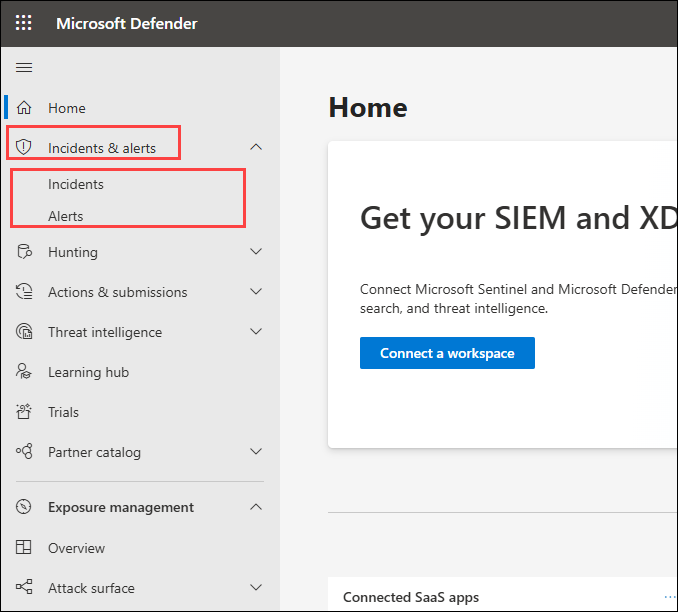

1. Click **Alerts** to view the alerts queue.

1. You will find alerts with the below names
     - **Lateral movement using remote logon by contained user blocked**
     - **Lateral movement using RDP blocked**

       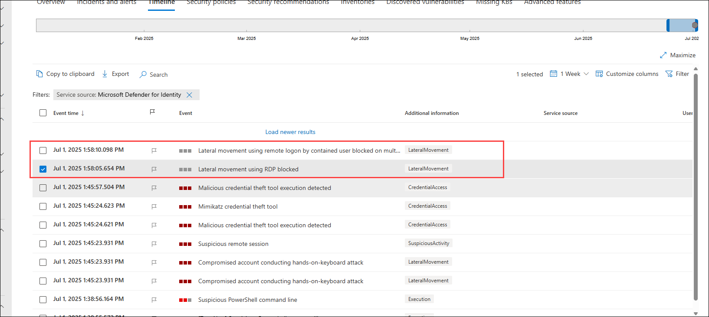

       > **Note:** The user will be logged out of the virtual machine as part of the containment measures initiated by the Defender in response to the user's attempted lateral movement attack.

### Task 2: Investigate Threats and User Timelines 

In this task you will analyze using user timelines and alert details in the Defender portal.

1. In the Microsoft Defender portal, in the search bar, type `demouser` and select it.

      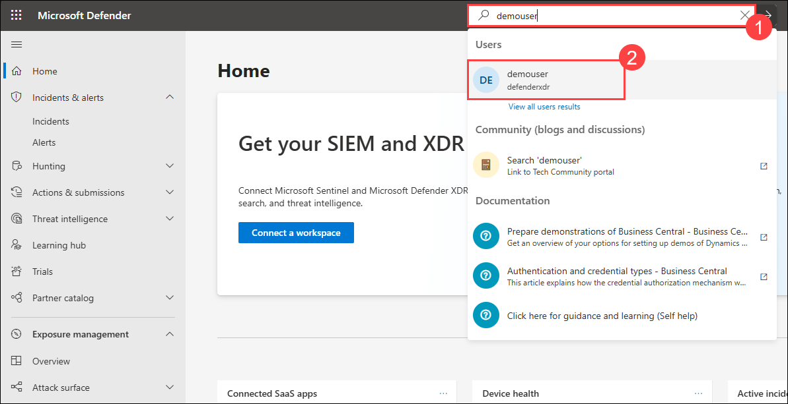

1. Click on **Go to user page**

      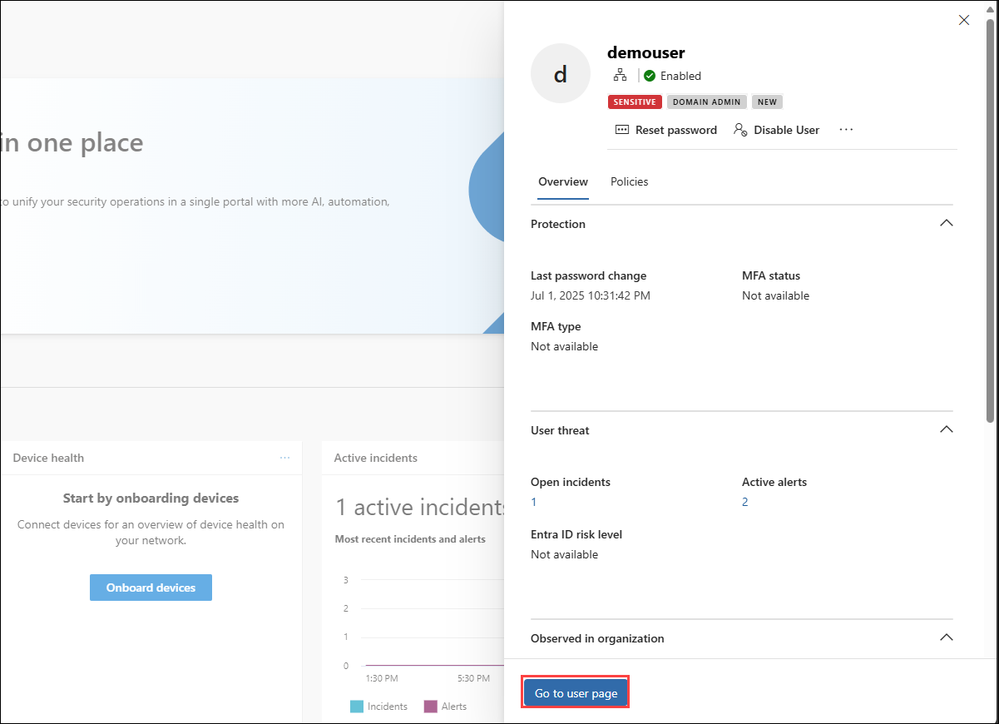

1. In the user profile, click the **Timeline** tab to view all events and alerts.

      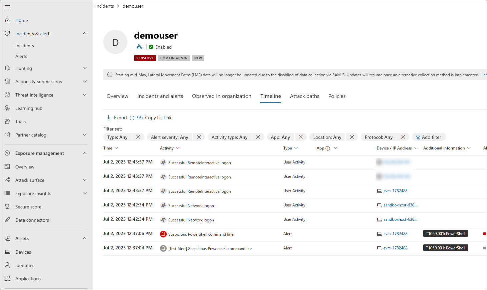

### Task 3: Integrate Defender for Identity with Microsoft 365 Defender Portal

In this task you will enable integration to view Defender for Identity incidents in the unified Microsoft 365 Defender portal and Microsoft Sentinel.

1. In the **Azure portal**, search for **Microsoft Sentinel (1)** in the top search bar and click **Microsoft Sentinel (2)** under the Services section.

      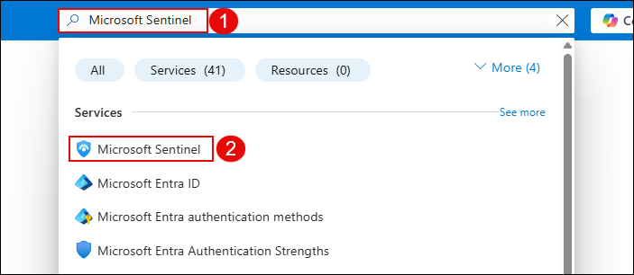

      > **Note:** If there is **no Sentinel deployed yet**, follow the steps from **Step 2 to Step 8** to create and connect a new workspace. 

      > If Sentinel is already set up, you can **skip to Step 9** and continue from there.

1. On the **Microsoft Sentinel** page, click **+ Create** to start setting up a new Sentinel resource or workspace configuration.

      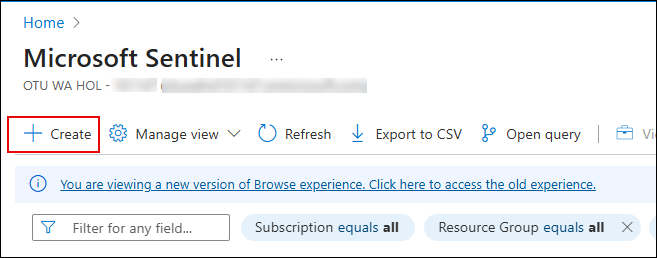

1. On the **Add Microsoft Sentinel to a workspace** page, click **+ Create a new workspace** to begin provisioning a Log Analytics workspace for Sentinel.

      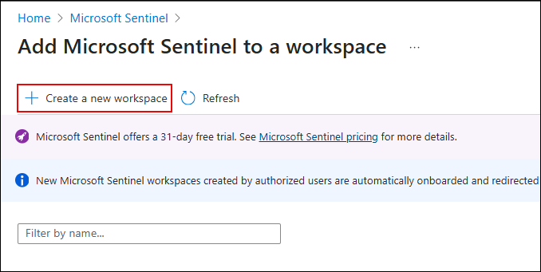

1. On the **Create Log Analytics workspace** page, configure the following settings:

   - Select the defualt **Subscription (1)**.
   - Choose **threadprotection-rg (2)** as the Resource group.
   - Enter a unique name for the workspace, **loganalyticworkspace (3)**.
   - Select **East US (4)** as the Region.
   - Click **Review + Create (5)** to proceed.

      

1. After validation passes, review the workspace details and click **Create** to deploy the Log Analytics workspace.

      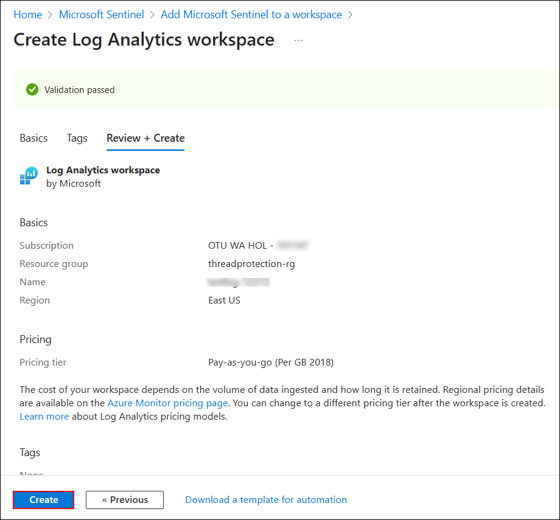

1. Once the workspace is created, return to **Microsoft Sentinel**. On the Sentinel page, click **+ Create** again.

      

1. On the **Add Microsoft Sentinel to a workspace** page, select the newly created workspace **loganalyticworkspace (1)** and click **Add (2)** to onboard it to Microsoft Sentinel.

      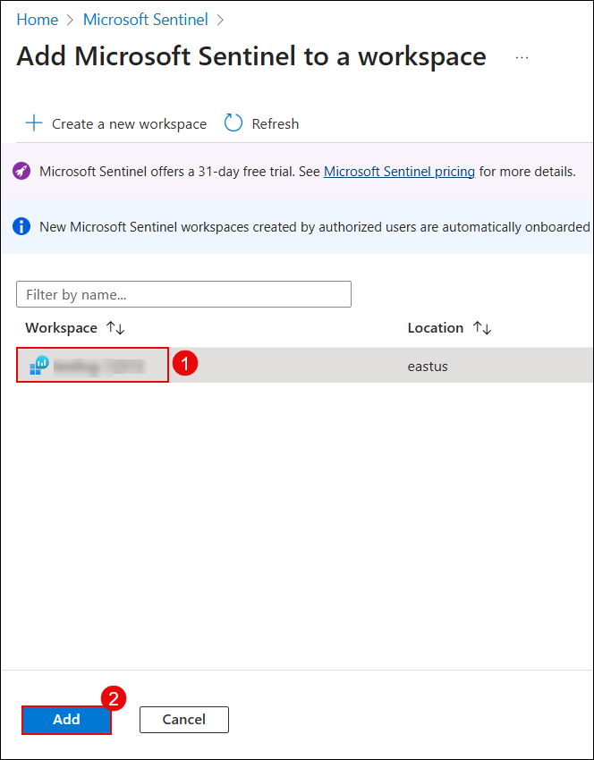

1. Navigate to `https://security.microsoft.com`. In the **Microsoft Defender** portal, expand **Content management (1)** under the **Microsoft Sentinel** section, and then click **Content hub (2)**.

      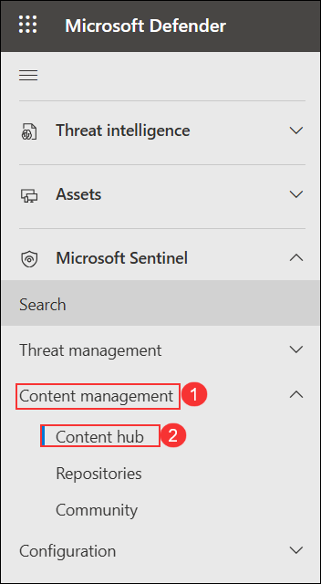

1. On the **Content hub** page, search for **Defender for XDR (1)**, select **Microsoft Defender XDR (2)** from the results, and then click **Install (3)** to add the solution. 

      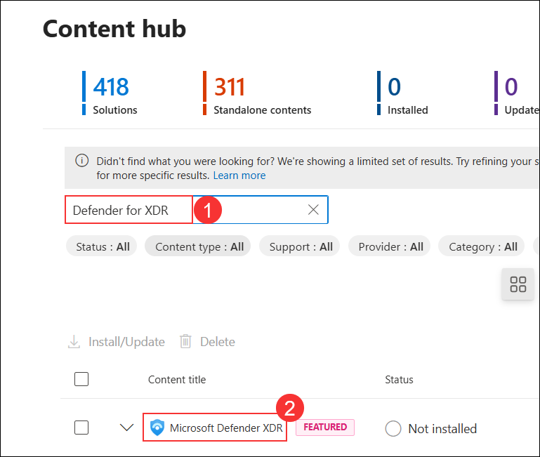

      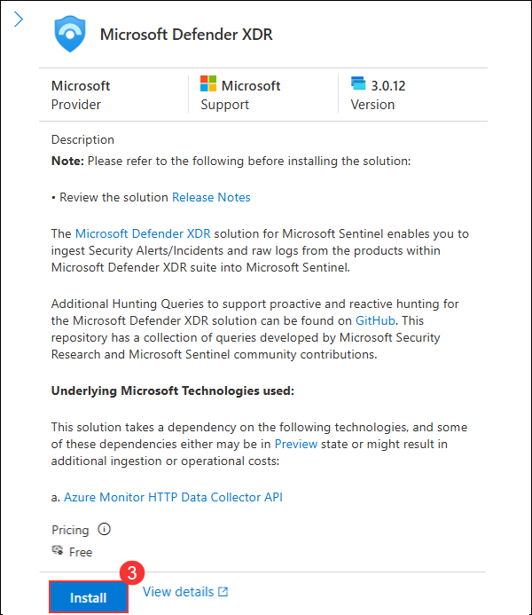

1. In the **Microsoft Sentinel** section, expand **Configuration (1)**, select **Automation (2)**, and then click **Configure permissions (3)**. 

      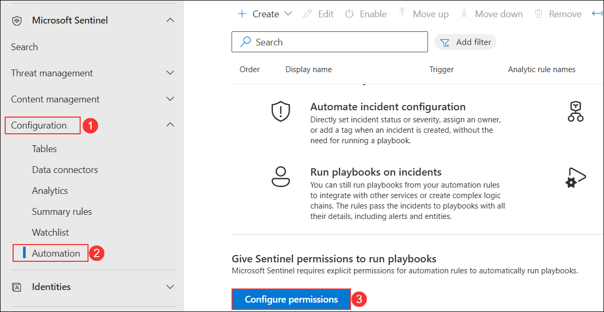

1. On the **Manage permissions** pane, select all resource groups including **threadprotection-rg** **1** by checking the boxes on the left. Then click **Apply 2** to grant Microsoft Sentinel permission to run playbooks in those resource groups.

      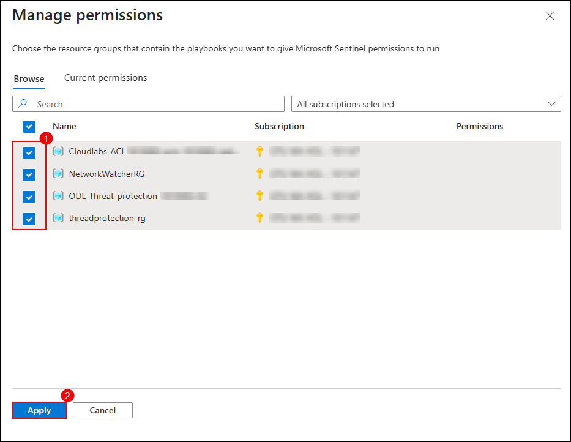

## Review

In this lab, you have completed the following tasks:

- Simulated a lateral movement attack using the DC Sync technique to test Defender for Identity detection.  
- Observed automatic threat response and containment triggered by Defender for Identity.  
- Investigated identity-based threats using the user timeline and activity alerts.  
- Integrated Defender for Identity with Microsoft 365 Defender and Microsoft Sentinel for centralized threat visibility.

### You have successfully completed the lab. Click on **Next >>** to proceed with the next Lab.


